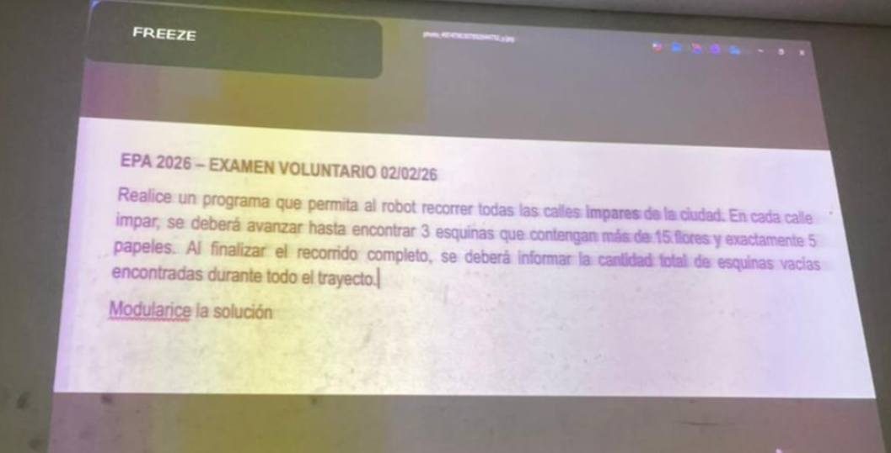

<h1 align="center"> 💻EPA  </h1>

> [!IMPORTANT]  
> Podes usar los pdfs y guiarte con los ejercicios resueltos en el repositorio para estudiar y practicar. Yo utilizo el visual studio code para programar y despues abro el archivo en el R-INFO para ejecutar el codigo.

---

- [Resumen de EPA VIDEO](https://www.youtube.com/watch?v=fDYjor2P-YQ)
- [Ejercicios adicionales](/documentos/adicionales.md)

---

## Examen Voluntario



```
programa Simulado
procesos

  proceso JuntarFlores (ES flores: numero)
  comenzar
    mientras (HayFlorEnLaEsquina)
      tomarFlor
      flores := flores + 1
  fin

  proceso JuntarPapeles (ES papeles: numero)
  comenzar
    mientras (HayPapelEnLaEsquina)
      tomarPapel
      papeles := papeles + 1
  fin

  proceso JuntarTodo (ES cantFlores: numero; ES cantPapeles: numero)
  comenzar
    cantFlores := 0
    cantPapeles := 0

    JuntarFlores(cantFlores)
    JuntarPapeles(cantPapeles)
  fin

  proceso RecorrerCalle (ES contEsqVacias: numero)
  variables
    esqCumple, flores, papeles: numero
    avActual, calleActual:numero
  comenzar
    avActual :=PosAv
    calleActual := PosCa
    esqCumple := 0
  
    mientras (esqCumple < 3)
      JuntarTodo(flores, papeles)
  
      si ((flores > 15) & (papeles = 5))
        esqCumple := esqCumple + 1
        Informar(esqCumple)
  
      si ((flores = 0) & (papeles = 0))
        contEsqVacias := contEsqVacias + 1
  
      si (PosAv < 100)
        si (PosCa < 100)
          mover
      si (PosAv = 100)
        calleActual := calleActual + 2
        Pos(avActual, calleActual)
  fin
areas
  ciudad: AreaC(1,1,100,100)

robots
  robot robot1
  variables
    contEsqVacias, : numero
  comenzar
    derecha
    RecorrerCalle(contEsqVacias)
    Informar(contEsqVacias)
  fin

variables
  R-info: robot1
comenzar
  AsignarArea(R-info, ciudad)
  Iniciar(R-info, 1, 1)
fin
```