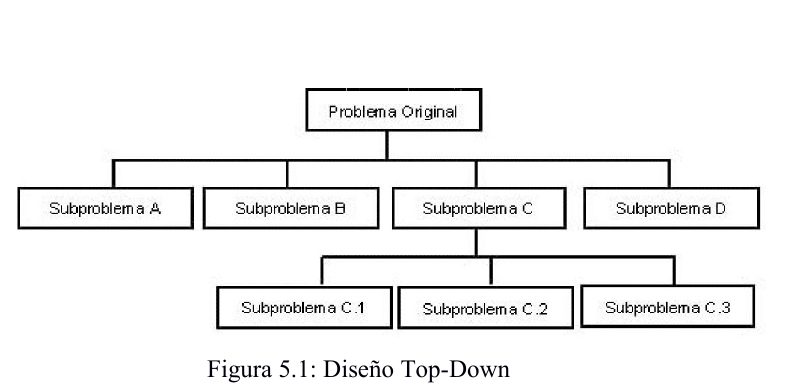
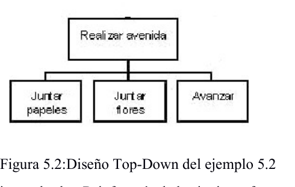
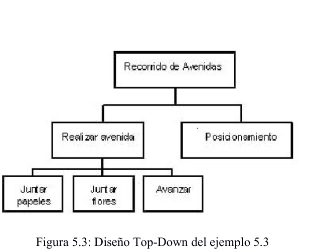
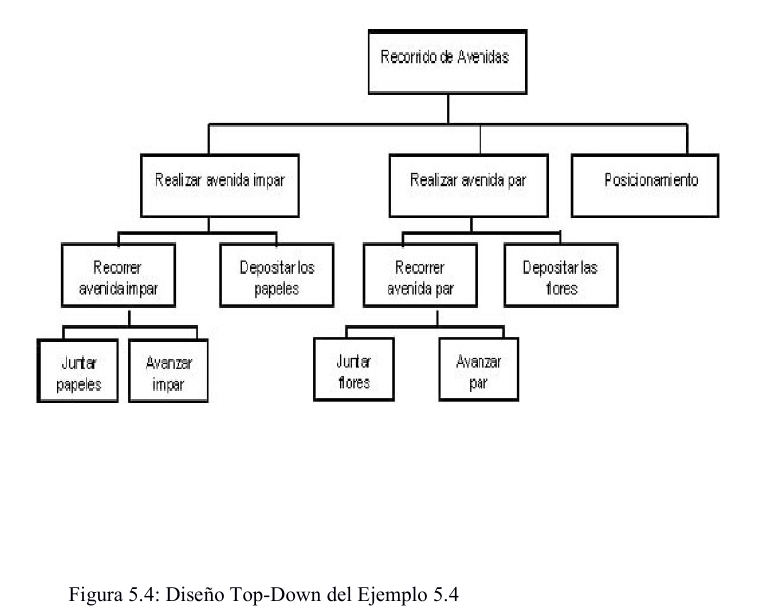
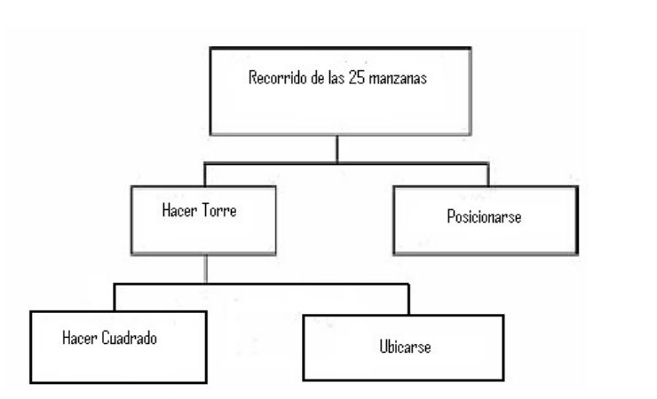
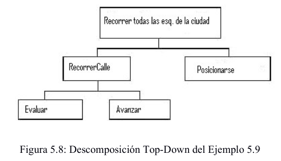
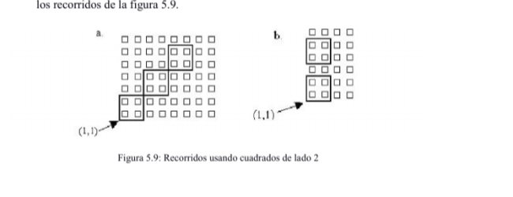
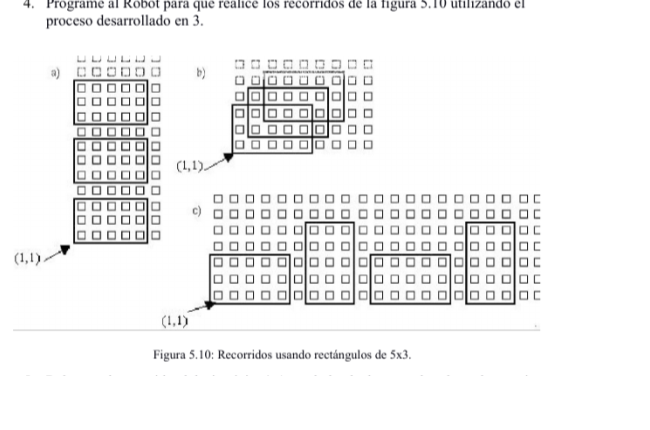
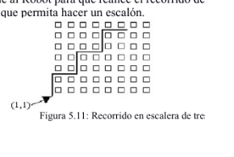

# Capítulo 5 - Programación Estructurada

> **Objetivo**
>
> Este capítulo introduce una metodología que permitirá facilitar la resolución de problemas. La propuesta radica en descomponer las tareas a realizar en subtareas más sencillas de manera de no tener que escribir un programa como un todo.
>
> Los problemas del mundo real, en general, resultan ser complejos y extensos. Si se pretende seguir con la forma de trabajo hasta aquí utilizada, se verá que resulta difícil cubrir todos los aspectos de la solución.
>
> Por ejemplo, supongamos que se pide que el robot R-info recorra todas las avenidas de la ciudad juntando flores y papeles e informe la cantidad de flores por avenida y el total de papeles durante todo el recorrido, seguramente nos resultará más natural y sencillo pensar en términos de tareas. Por ejemplo, recorrer una avenida contando flores y papeles, informar cantidad de flores de la avenida, posicionarse en la avenida siguiente, poner la cantidad de flores en cero, y al finalizar el recorrido informar la cantidad de papeles.
>
> Esta forma de trabajo es lo que se formalizará a partir de este capítulo y se presentarán sus beneficios.

**Temas a tratar**

- ✔ Descomposición de problemas en partes
- ✔ Programación modular
- ✔ Conclusiones
- ✔ Ejercitación

## 5.1 Descomposición de problemas en partes

> Una de las herramientas más útiles en la resolución de problemas con computadora es la descomposición de los problemas a resolver en subproblemas más simples. Esta descomposición, que se basa en el paradigma **"Divide y Vencerás"**, persigue un objetivo: cada problema es dividido en un número de subproblemas más pequeños, cada uno de los cuales a su vez, puede dividirse en un conjunto de subproblemas más pequeños aún, y así siguiendo. Cada uno de estos subproblemas debiera resultar entonces más simple de resolver. Una metodología de resolución con estas características se conoce como diseño Top-Down.

La figura 5.1 muestra la representación en forma de árbol de una descomposición Top-Down.



**Figura 5.1: Diseño Top-Down**

El nivel de descomposición al que se llega depende de los conocimientos de quien va a implementar la solución (obviamente, el nivel de detalle al que puede arribar un experto no es el mismo que al que llegará un novato).

Es decir, que con esta metodología, resolver el problema original se reduce a resolver una serie de problemas más simples o subproblemas. En cada paso del proceso de resolución, cada subproblema es refinado hasta llegar a un punto en que está compuesto de acciones tan simples que ya no tiene sentido seguir refinando.

> Cuando se realiza esta descomposición debe tenerse en cuenta que los subproblemas que se encuentran a un mismo nivel de detalle pueden resolverse independientemente de los demás y que las soluciones de estos subproblemas deben combinarse para resolver el problema original.

De la figura 5.1 podemos inducir que la resolución de los subproblemas C.1, C.2 y C.3 implica resolver el problema C. A su vez la resolución de los subproblemas A, B, C y D permitirán obtener la resolución del problema original. Es importante destacar que los subproblemas pueden ser resueltos de manera independiente entre sí y desarrollado por diferentes grupos de trabajo.

> *Haciendo clic en el siguiente link podés acceder a una animación con un ejemplo de Modularización: Animación Modularización (recurso multimedia del material original).*

## 5.2 Programación modular

La metodología descripta en la sección anterior puede aplicarse al diseño de programas. Un buen diseño nos permitirá dividir nuestra solución en un número de piezas manejables llamadas **módulos**, cada uno de los cuales, tiene una tarea perfectamente definida.

Esta metodología, conocida como **modularización** ó **diseño Top Down**, es una de las técnicas más importantes para lograr un buen diseño de programa.

La **programación modular** es uno de los métodos de diseño más flexibles y potentes para mejorar la productividad de un programa. La descomposición de un programa en módulos independientes más simples se conoce también como el método de "divide y vencerás". Se diseña cada módulo con independencia de los demás y, siguiendo un método descendente, se llega hasta la descomposición final del problema en módulos en forma jerárquica.

En consecuencia, el programa se divide en módulos (partes independientes), cada uno de los cuales ejecuta una única actividad o tarea específica. Dichos módulos se analizan, codifican y ponen a punto por separado. Si la tarea asignada a cada módulo es demasiado compleja, este deberá descomponerse en otros módulos más pequeños. El proceso sucesivo de subdivisión continúa hasta que cada módulo tenga sólo una tarea específica que ejecutar.

Esta metodología de trabajo ofrece numerosas ventajas entre las que se pueden mencionar:

### Independencia entre los módulos

Dado que los módulos son independientes, diferentes programadores pueden trabajar simultáneamente en distintas partes de un mismo programa. Esto reduce el tiempo de diseño y codificación del algoritmo.

Revisemos el siguiente ejemplo: El robot debe acomodar las esquinas de la ciudad de manera que en cada una quede la misma cantidad de flores que de papeles. Para hacerlo, recogerá lo que sobra. Por ejemplo, si en una esquina hay 10 flores y 14 papeles, se llevará 4 papeles para dejar 10 de cada uno. Las esquinas vacías serán consideradas equilibradas por lo que quedarán así.

Puede verse que el procesamiento de una esquina en particular es independiente del resto del programa. Podría encargarse su diseño e implementación a otra persona. Se denominará a esta persona Programador A. Como resultado de la tarea del programador A se obtendrá un módulo que iguala la cantidad de flores y de papeles haciendo que el robot se lleve lo que sobra. El programador B será el encargado de usar este módulo en la resolución de este problema.

Es importante notar que al programador B no le interesa cómo hizo el programador A para igualar la cantidad de elementos de la esquina. Por su parte, el programador A desconoce cómo se utilizará el módulo que está implementando. Esto hace que ambos programadores trabajen con subproblemas más simples que el problema original. El programador A sólo se dedica al procesamiento de una esquina y el programador B sólo se preocupa porque el robot recorra todas las esquinas de la ciudad, dando por hecho el procesamiento de cada esquina.

### Modificación de los módulos

Cada módulo tiene una tarea específica que debe llevar a cabo. En su interior sólo se definen acciones relacionadas con este fin. Por tal motivo, la modificación interna de un módulo no afectará al resto.

Volviendo al ejemplo anterior, suponga que debe modificarse el procesamiento de cada esquina de manera que el robot iguale la cantidad de elementos intentando depositar primero (igualará hacia el número superior) y si no tiene, recién entonces se llevará lo que sobra. Al tener el comportamiento de la esquina encerrado en un módulo, bastará con realizar allí las modificaciones para que todos los programas que lo utilicen se vean actualizados SIN necesidad de cambiar nada.

### Reusabilidad de código

El desarrollo de un módulo es independiente del problema original que se desea resolver. Por ejemplo, podría definirse un módulo que permita al robot girar a la izquierda. Cuando esté implementado, podrá ser aplicado en múltiples recorridos. El concepto de reusabilidad hace hincapié en la ventaja de utilizar cada módulo directamente sin necesidad de volver a pensarlo nuevamente. No importa cómo hace para quedar posicionado hacia la izquierda, lo que importa es que el módulo cumple con la función especificada. En otras palabras, para poder utilizar un módulo no interesa saber cómo está implementado internamente sino que alcanza con saber qué es lo que hace. Obviamente el hacedor o implementador del módulo deberá ocuparse de que ese módulo cumpla la función de la mejor manera posible. Es por ello que los que luego lo utilizarán pueden desentenderse del cómo lo hace y concentrarse en qué hace.

### Mantenimiento del código

Una vez que el programa es puesto en marcha resulta común que aparezcan errores de diseño, ya sea porque no se interpretaron correctamente los requerimientos del usuario o porque han cambiado las especificaciones.

Cuando se desea realizar modificaciones, el uso de módulos es muy beneficioso ya que cada tarea se encuentra concentrada en un lugar del programa y basta con cambiar esta parte para llevar a cabo la actualización. Es más fácil encontrar dentro del programa, el lugar dónde deben efectuarse las modificaciones.

Por ejemplo, inicialmente el módulo encargado de hacer girar al robot a la izquierda podría utilizar siete giros a derecha pero luego de verlo funcionar se ve la conveniencia de realizar solo tres giros. Resulta claro ver que hay que ir al módulo que hace girar al robot y efectuar los cambios allí. Si no se utiliza un módulo con estas características, seguramente habría varios lugares dentro del programa donde habría que hacer modificaciones, aumentando así la posibilidad de error.

> En general, en las soluciones modularizadas, un programa es un módulo en sí mismo denominado programa principal que controla todo lo que sucede y es el encargado de transferir el control a los submódulos de modo que ellos puedan ejecutar sus funciones y resolver el problema. Cada uno de los submódulos al finalizar su tarea, devuelve el control al módulo que lo llamó.
> Un módulo puede transferir temporalmente el control a otro módulo; en cuyo caso, el módulo llamado devolverá el control al módulo que lo llamó, al finalizar su tarea.

A continuación se presenta la sintaxis a utilizar para la definición de módulos en el ambiente de programación del robot R-info.

```
proceso nombre del módulo
   comenzar
   { acciones a realizar dentro del módulo }
   fin
```

Como todo lo que se ha definido en este ambiente de programación existe en el mismo una sección especial para la declaración de los procesos llamada "procesos". En esta sección se pueden declarar todos los procesos que el programador necesite para resolver el algoritmo.

Por lo tanto, el esquema general de un programa que utilice módulos es el siguiente:

```
programa ejemploProcesos
procesos
  proceso uno              ->  Sección para definir los procesos
  comenzar
    ….  Código del proceso
  fin
areas
  ciudad: areaC(1,1,100,100)
robots
  robot robot1
  comenzar
    uno
    mover
    uno
  fin
variables
  R-info : robot1
comenzar
  AsignarArea (R-info,ciudad)
  iniciar (robot1 , 1 , 1)
fin
```

#### Ejemplo 5.1

**Enunciado:** Se desea programar al robot para que recoja todas las flores de la esquina (1,1) y de la esquina (1,2).

| Solución sin modularizar | Solución modularizada |
|---|---|
| ```programa Cap5Ejemplo5.1``` <br> ```areas``` <br> ```  ciudad: AreaC(1,1,100,100)``` <br> ```robots``` <br> ```  robot robot1``` <br> ```  comenzar``` <br> ```    mientras HayFlorEnLaEsquina``` <br> ```      tomarFlor``` <br> ```    mover``` <br> ```    mientras HayFlorEnLaEsquina``` <br> ```      tomarFlor``` <br> ```  fin``` <br> ```variables``` <br> ```  R-info : robot1``` <br> ```Comenzar``` <br> ```  AsignarArea (R-info, ciudad)``` <br> ```  Iniciar (robot1 , 1 , 1)``` <br> ```fin``` | ```programa Cap5Ejemplo5.1.2``` <br> ```procesos``` <br> ```  proceso JuntarFlores          {3}``` <br> ```  comenzar``` <br> ```    mientras HayFlorEnLaEsquina``` <br> ```      tomarFlor``` <br> ```  fin``` <br> ```areas``` <br> ```  ciudad: AreaC(1,1,100,100)``` <br> ```robots``` <br> ```  robot robot1``` <br> ```  comenzar``` <br> ```    JuntarFlores                {2}``` <br> ```    mover                       {4}``` <br> ```    JuntarFlores                {5}``` <br> ```  fin                           {6}``` <br> ```variables``` <br> ```  R-info : robot1``` <br> ```comenzar``` <br> ```  AsignarArea (R-info, ciudad)``` <br> ```  Iniciar (robot1 , 1 , 1)      {1}``` <br> ```fin``` |

En la solución sin modularizar, nos vemos obligados a escribir dos veces el mismo código debido a que la tarea a realizar en las dos esquinas es la misma.

En la solución modularizada, en cambio, nos alcanza con invocar al módulo JuntarFlores cada vez que se quiera recoger flores en una esquina cualquiera. En este caso particular será necesario invocar a dicho módulo dos veces.

La ejecución del programa Cap5Ejemplo5.1.2 (solución modularizada) comienza por la línea (1). A continuación, la instrucción (2) realiza la llamada o invocación al proceso JuntarFlores. Esto hace que se suspenda la ejecución del código del robot R-info y el control pase a la línea (3) donde se encuentra el inicio del proceso. Cuando este termina su ejecución, el robot habrá recogido todas las flores de la esquina y el control volverá a la línea siguiente a la que hizo la invocación (4). El robot avanzará a la esquina (1,2) y en la línea (5) se llamará al mismo proceso nuevamente, lo que produce que se vuelva a ejecutar desde (3) nuevamente. Cuando este proceso haya finalizado, el control volverá a la línea (6) y el robot se detendrá llevando en su bolsa las flores de las esquinas (1,1) y (1,2).

#### Ejemplo 5.2

**Enunciado:** Se desea programar al robot para que recorra la avenida 1 juntando todas las flores y los papeles que encuentre.

Esto puede simplificarse si se utiliza la metodología Top-Down ya descripta. Este programa se puede descomponer en módulos, de modo que exista un módulo principal y diferentes submódulos como se muestra en la figura 5.2.



**Figura 5.2: Diseño Top-Down del ejemplo 5.2**

El código correspondiente al robot R-info sería de la siguiente forma:

```
Para cada esquina de la avenida 1
    {Juntar todas las flores de la esquina}
    {Juntar todos los papeles de la  esquina}
    {Avanzar a la próxima esquina}
```

Por lo tanto, el programa quedaría entonces de la siguiente manera:

```
programa Cap5Ejemplo5.2
procesos
  proceso JuntarFlores
  comenzar
    mientras HayFlorEnLaEsquina
      tomarFlor
  fin
  proceso JuntarPapeles
  comenzar
    mientras HayPapelEnLaEsquina
      tomarPapel
  fin
areas
  ciudad: AreaC(1,1,100,100)
robots
  robot robot1
  comenzar
    repetir 99
      JuntarFlores
      JuntarPapeles
      mover
    JuntarFlores
    JuntarPapeles
  fin
variables
  R-info : robot1
comenzar
  AsignarArea(R-info,ciudad)
  Iniciar (R-info , 1 , 1)
fin
```

#### Ejemplo 5.3

**Enunciado:** Se desea programar al robot para que recorra las primeras 10 avenidas juntando todas las flores y los papeles que encuentre.



**Figura 5.3: Diseño Top-Down del ejemplo 5.3**

| Solución 1 | Solución 2 |
|---|---|
| ```programa Cap5Ejemplo5.3.Solucion1``` <br> ```procesos``` <br> ```  proceso JuntarFlores``` <br> ```  comenzar``` <br> ```    mientras HayFlorEnLaEsquina``` <br> ```      tomarFlor``` <br> ```  fin``` <br> ```  proceso JuntarPapeles``` <br> ```  comenzar``` <br> ```    mientras HayPapelEnLaEsquina``` <br> ```      tomarPapel``` <br> ```  fin``` <br> ```areas``` <br> ``` ciudad: AreaC(1,1,100,100)``` <br> ```robots``` <br> ```  robot robot1``` <br> ```  comenzar``` <br> ```    repetir 10``` <br> ```      repetir 99``` <br> ```        JuntarFlores``` <br> ```        JuntarPapeles``` <br> ```        mover``` <br> ```      {Falta última esquina}``` <br> ```      JuntarFlores``` <br> ```      JuntarPapeles``` <br> ```      Pos(PosAv + 1 ,1)``` <br> ```  fin``` <br> ```variables``` <br> ```  R-info : robot1``` <br> ```comenzar``` <br> ```  AsignarArea (R-info,ciudad)``` <br> ```  Iniciar (R-info, 1 ,1)``` <br> ```fin``` | ```programa Cap5Ejemplo5.3.Solucion2``` <br> ```procesos``` <br> ```  proceso JuntarFlores``` <br> ```  comenzar``` <br> ```    mientras HayFlorEnLaEsquina``` <br> ```      tomarFlor``` <br> ```  fin``` <br> ```  proceso JuntarPapeles``` <br> ```  comenzar``` <br> ```    mientras HayPapelEnLaEsquina``` <br> ```      tomarPapel``` <br> ```  fin``` <br> ```  proceso Avenida``` <br> ```  comenzar``` <br> ```    repetir 99``` <br> ```      JuntarFlores``` <br> ```      JuntarPapeles``` <br> ```      mover``` <br> ```    JuntarFlores``` <br> ```    JuntarPapeles``` <br> ```  fin``` <br> ```areas``` <br> ```  ciudad: AreaC(1,1,100,100)``` <br> ```robots``` <br> ```  robot robot1``` <br> ```  comenzar``` <br> ```    repetir 10``` <br> ```      Avenida``` <br> ```      Pos(PosAv + 1 ,1)``` <br> ```  fin``` <br> ```variables``` <br> ```  R-info : robot1``` <br> ```comenzar``` <br> ```  AsignarArea (R-info,ciudad)``` <br> ```  Iniciar (R-info , 1 ,1)``` <br> ```fin``` |

Como podemos observar, ambas soluciones resuelven el problema. Sin embargo en la solución 2, el programa principal resulta más legible debido a la utilización del módulo Avenida.

Por otra parte, hay que destacar que en la solución 2, desde el módulo Avenida se está invocando a los módulos JuntarFlores y JuntarPapeles. Para que el módulo Avenida pueda invocar correctamente a los módulos JuntarFlores y JuntarPapeles, estos deben estar previamente declarados.

> **Actividad:** Analice el programa anterior realizando un seguimiento de la invocación de los procesos involucrados.

#### Ejemplo 5.4

**Enunciado:** Se desea programar al robot para que recorra las primeras 50 avenidas juntando las flores de las avenidas pares y los papeles de las avenidas impares. Al finalizar cada avenida debe depositar todos los elementos recogidos. Considere que inicialmente la bolsa está vacía.

Al igual que en los ejemplos anteriores, este programa se puede descomponer en módulos y submódulos. La idea principal de lo que debería hacer el robot es la siguiente:

```
Recorrido de Avenidas
    {Realizar avenida impar}
    {Realizar avenida par}
    {Posicionamiento para la próxima avenida}
```

Notemos que la complejidad de los módulos no es la misma. En particular, el último módulo sólo implica reubicar al robot en otra esquina, por lo cual, su refinamiento no es necesario.

Si lo consideramos necesario, podemos continuar refinando los módulos que procesan las avenidas de la siguiente manera:

```
Módulo Realizar avenida impar
    {Recorrer la avenida impar juntando papeles}
    {Depositar los papeles encontrados al finalizar la avenida impar}

Módulo Realizar avenida par
    {Recorrer la avenida par juntando flores}
    {Depositar las flores encontradas al finalizar el recorrido}
```

En un nivel más de refinamiento, estos módulos pueden volver a descomponerse de la siguiente forma:

```
Submódulo Recorrer la avenida impar juntando papeles
    {para cada esquina de la avenida impar}
       { recoger todos los papeles de la esquina}
       { avanzar una cuadra sobre la avenida impar}

Submódulo Recorrer la avenida par juntando flores
    {para cada esquina de la avenida par}
       {recoger todas las flores de la esquina}
       {avanzar una cuadra sobre la avenida par}
```



**Figura 5.4: Diseño Top-Down del Ejemplo 5.4**

La representación gráfica se muestra en la figura 5.4. Puede verse que a nivel de módulo se considera como elemento de trabajo a la avenida mientras que a nivel de submódulo se hace sobre las esquinas de cada avenida.

Recordemos que la descomposición Top-Down parte del problema general descomponiéndolo en tareas cada vez más específicas y el concentrarse en una tarea en particular es más simple que resolver el problema completo. En el ejemplo, es más simple resolver una única avenida par que intentar resolver las 25 avenidas pares en forma conjunta. Lo mismo ocurre con las impares.

En la resolución de este problema pueden utilizarse los procesos JuntarFlores y JuntarPapeles definidos anteriormente. Además se necesitarán algunos otros módulos: DejarPapeles, DejarFlores, RealizarAvenidaImpar y RealizarAvenidaPar.

A continuación se presenta el programa completo que resuelve el ejemplo 5.4.

```
programa Cap5Ejemplo5.4
procesos
  proceso JuntarFlores
  comenzar
    mientras HayFlorEnLaEsquina
      tomarFlor
  fin
  proceso JuntarPapeles
  comenzar
    mientras HayPapelEnLaEsquina
      tomarPapel
  fin
  proceso DejarFlores
  comenzar
    mientras HayFlorEnLaBolsa
      depositarFlor
  fin
  proceso DejarPapeles
  comenzar
    mientras HayPapelEnLaBolsa
      depositarPapel
  fin
  proceso RealizarAvenidaPar
  comenzar
    repetir 99
      JuntarPapeles
      mover
    DejarPapeles
  fin
  proceso RealizarAvenidaImpar
  comenzar
    repetir 99
      JuntarFlores
      mover
    DejarFlores
  fin
areas
  ciudad: AreaC(1,1,100,100)
robots
  robot robot1
  comenzar
    repetir 25
      RealizarAvenidaImpar
      Pos(PosAv + 1 ,1)
      RealizarAvenidaPar
      Pos(PosAv +1 , 1)
  fin
variables
  R-info : robot1
comenzar
  AsignarArea (R-info,ciudad)
  Iniciar (R-info , 1 ,1)
fin
```

> Nota: el proceso RealizarAvenidaPar utiliza JuntarPapeles y DejarPapeles, mientras que RealizarAvenidaImpar utiliza JuntarFlores y DejarFlores; esto responde al enunciado, que pide juntar **papeles** en las avenidas **pares** y **flores** en las **impares** (obsérvese que el texto descriptivo previo lo planteaba al revés como ejemplo de refinamiento; el código final del programa es el que resuelve exactamente lo pedido en el enunciado).

Sobre el ejemplo anterior pueden analizarse los siguientes aspectos:

> **Actividad:**
> - Se han reusado los procesos JuntarFlores *y* JuntarPapeles evitando de esta manera el tener que volver a pensar e implementar la recolección de cada tipo de elemento dentro de una esquina específica.

- Si en el ejemplo 5.2 se hubiera escrito un único proceso que juntara todos los elementos de la esquina, no hubiera sido posible el reuso mencionado anteriormente. Esto lleva a tratar de escribir módulos lo suficientemente generales como para que puedan ser aplicados en distintas soluciones.
- Podemos notar que no todos los submódulos de la figura 5.4 se han convertido en procesos. Esto se debe a que algunos de ellos son suficientemente simples como para traducirse en una instrucción del robot. Por ejemplo, "Avanzar impar" se traduce en la instrucción mover.

#### Ejemplo 5.5

**Enunciado:** Programe al robot para que recorra el perímetro del cuadrado determinado por (1,1) y (2,2). Al terminar debe informar cuántos de los vértices estaban vacíos.

Para resolverlo es conveniente comenzar a analizar las distintas partes que componen el problema:

```
{Analizar el vértice y registrar si está vacío}
{Avanzar 1 cuadra}
{Girar a la izquierda}
{Informar lo pedido}
```

Las primeras tres acciones se repiten cuatro veces para poder dar vuelta al cuadrado y la última se realiza cuando el robot ha terminado de recorrer el perímetro.

> Note que la descomposición en módulos del problema no busca representar flujo de control del programa. En otras palabras, las estructuras de control no se encuentran reflejadas en la metodología Top-Down. Sólo se indican las partes necesarias para resolverlo, de manera de dividir el trabajo en tareas más sencillas. La unión de estos módulos, para hallar la solución, es una tarea posterior. Por este motivo, tampoco se repiten los módulos dentro de la descomposición planteada.

Todas las tareas indicadas en la descomposición anterior son lo suficientemente simples como para ser implementadas directamente. Una solución al problema podría ser la siguiente:

```
programa Cap5Ejemplo5.5
areas
  ciudad: AreaC(1,1,100,100)
robots
  robot robot1
  variables
    vacias : numero
  comenzar
    derecha
    vacias := 0
    repetir 4
      {Analizar el vértice y registrar si está vacio}
      si ~ HayFlorEnLaEsquina& ~HayPapelEnLaEsquina
        vacias := vacias + 1
      mover
      {Girar a la izquierda}
      repetir 3
        derecha
      Informar  (vacias)
  fin
variables
  R-info : robot1
comenzar
  AsignarArea (R-info, ciudad)
  Iniciar (R-info , 1 ,1)
fin
```

Sin embargo, sería importante contar con un proceso que permitiera indicar al robot girar izquierda con la misma facilidad con que se indica que gire a derecha. Esto haría más legible los programas ya que el programa anterior podría escribirse de la siguiente forma:

```
programa Cap5Ejemplo5.5
areas
  ciudad: areaC(1,1,100,100)
robots
  robot robot1
  variables
    vacias : numero
  comenzar
    derecha
    vacias := 0
    repetir 4
      {Analizar el vértice y registrar si está vacio}
      si ~ HayFlorEnLaEsquina& ~HayPapelEnLaEsquina
        vacias := vacias + 1
      mover
      {Girar a la izquierda}
      izquierda
      Informar  (vacias)
  fin
variables
  R-info : robot1
comenzar
  AsignarArea (R-info, ciudad)
  iniciar (robot1 , 1 ,1)
fin
```

> **Actividad:**
> - Queda como ejercicio para el lector la definición del proceso izquierda.
> - Una vez que haya incorporado a la solución anterior el proceso izquierda, indique la cantidad de veces que el robot gira a la derecha para completar el recorrido.

#### Ejemplo 5.6

**Enunciado:** Dados los recorridos de la figura 5.6 ¿Cuál es el módulo que sería conveniente tener definido?

**Figura 5.6: Recorridos** (descripción de las cuatro figuras, todas construidas a partir de cuadrados de lado 2 sobre la grilla de la ciudad):

- **a)** Tres cuadrados de lado 2 dispuestos en una misma fila, separados entre sí (sin tocarse), como tres "islas" cuadradas alineadas horizontalmente.
- **b)** Una sucesión de cuadrados de lado 2 dispuestos en forma de escalera, cada uno desplazado hacia arriba y a la derecha respecto del anterior (patrón diagonal ascendente).
- **c)** Cuadrados de lado 2 superpuestos formando una figura compacta en forma de cruz/rombo, con varios cuadrados que comparten lados en el centro de la grilla.
- **d)** Una fila de cuadrados de lado 2 dispuestos uno junto a otro, tocándose, formando una franja horizontal continua a lo largo de varias columnas.

Como podemos observar todos los cuadrados tienen lado 2, entonces convendría tener definido un módulo que permita realizar un cuadrado de lado 2 ya que puede utilizarse en los cuatro recorridos. Como muestra la figura 5.6 cada recorrido consiste en realizar varios cuadrados de lado 2 con el robot posicionado en lugares diferentes.

El módulo a utilizar puede escribirse de la siguiente forma:

```
proceso cuadrado
comenzar
  repetir 4      {el cuadrado tiene 4 lados}
    repetir 2
      mover
fin
```

En este momento puede apreciarse una de las principales ventajas de la modularización. Esta implementación del proceso cuadrado es independiente del recorrido en el cual será utilizado. Es más, este proceso puede ser verificado de manera totalmente independiente de la aplicación final.

El programador encargado de su desarrollo podría escribir el siguiente programa para verificar su funcionamiento:

```
programa Cap5Ejemplo5.6
procesos
  proceso cuadrado
  comenzar
    repetir 4
      repetir 2
        mover
  fin
areas
  ciudad: AreaC(1,1,100,100)
robots
  robot robot1
  comenzar
    Pos (2,1)
    cuadrado
  fin
variables
  R-info : robot1
comenzar
  AsignarArea (R-info,ciudad)
  Iniciar (R-info , 1 ,1)
fin
```

Una vez que se ha verificado que el funcionamiento del proceso cuadrado es correcto, su programador lo ubicará en un lugar común donde todos aquellos que lo requieran lo puedan acceder. Ahora, los usuarios del proceso cuadrado no sólo no tendrán la necesidad de implementar este recorrido sino que además cuentan con un proceso que funciona correctamente porque ya fue verificado previamente.

En este sentido, el ambiente de programación del robot R-info presenta algunas limitaciones ya que los interesados en el módulo deberán insertarlo dentro de su programa. Sin embargo, esto no es así en la mayoría de los lenguajes y este aspecto no debería invalidar las ventajas de la modularización.

Los siguientes programas resuelven el recorrido a) de la figura 5.6:

| Cap5Ejemplo5.6.version1 | Cap5Ejemplo5.6.version2 |
|---|---|
| ```programa Cap5Ejemplo5.6.version1``` <br> ```procesos``` <br> ```  proceso cuadrado``` <br> ```  comenzar``` <br> ```    repetir 4``` <br> ```      repetir 2``` <br> ```        mover``` <br> ```      derecha``` <br> ```  fin``` <br> ```areas``` <br> ```  ciudad: AreaC(1,1,100,100)``` <br> ```robots``` <br> ```  robot robot1``` <br> ```  comenzar``` <br> ```    Pos(2,1)``` <br> ```    cuadrado``` <br> ```    Pos(5,1)``` <br> ```    cuadrado``` <br> ```    Pos(8,1)``` <br> ```    cuadrado``` <br> ```  fin``` <br> ```variables``` <br> ```  R-info : robot1``` <br> ```comenzar``` <br> ```  AsignarArea (R-info,ciudad)``` <br> ```  Iniciar (R-info , 1 ,1)``` <br> ```fin``` | ```programa Cap5Ejemplo5.6.version2``` <br> ```procesos``` <br> ```  proceso cuadrado``` <br> ```  comenzar``` <br> ```    repetir 4``` <br> ```      repetir 2``` <br> ```        mover``` <br> ```      derecha``` <br> ```  fin``` <br> ```areas``` <br> ```  ciudad: AreaC(1,1,100,100)``` <br> ```robots``` <br> ```  robot robot1``` <br> ```  comenzar``` <br> ```    Pos(2,1)``` <br> ```    repetir 3``` <br> ```      cuadrado``` <br> ```      Pos(PosAv+3,1)``` <br> ```  fin``` <br> ```variables``` <br> ```  R-info : robot1``` <br> ```comenzar``` <br> ```  AsignarArea (R-info,ciudad)``` <br> ```  Iniciar (R-info , 1 ,1)``` <br> ```fin``` |

Una de las diferencias entre estas soluciones es que el programa RecorridoA-version1 utiliza solo la secuencia mientras que RecorridoA version2 utiliza la estructura de control repetir.

En ambos casos aparecen tres invocaciones al proceso cuadrado con el robot ubicado en una esquina distinta.

El módulo Cuadrado tiene las siguientes características:

1. El cuadrado tiene como vértice inferior izquierdo la esquina donde el robot esta posicionado al momento de la invocación.
2. Una vez terminado el cuadrado, el robot vuelve a quedar parado en la misma esquina y orientado en el mismo sentido que cuando se comenzó la ejecución del módulo.

> **Actividad:** Justifique las siguientes afirmaciones:
> - Para que el programa RecorridoA-version1 funcione correctamente sólo es preciso conocer la primera de estas características.
> - En cambio, para que el programa RecorridoA-version2 funcione correctamente se requieren las dos.

A continuación se presentan una parte de la solución para el recorrido de la figura 5.6 b) (sólo se muestra el código del robot), en la solución de la izquierda se utiliza el modulo cuadrado y en la de la derecha no.

| Con módulo cuadrado | Sin módulo (implementación directa) |
|---|---|
| ```robots``` <br> ```  robot robot1``` <br> ```  comenzar``` <br> ```    repetir 3``` <br> ```      cuadrado``` <br> ```      Pos(PosAv+1, PosCa+2)``` <br> ```  fin``` | ```robots``` <br> ```  robot robot1``` <br> ```  comenzar``` <br> ```    repetir 3``` <br> ```      repetir 4``` <br> ```        mover``` <br> ```        mover``` <br> ```        derecha``` <br> ```      Pos(PosAv+1, PosCa+2)``` <br> ```  fin``` |

El programa RecorridoB version1 utiliza el proceso que realiza el cuadrado de lado 2, mientras que el programa RecorridoB version2 ha sido implementado igual que los ejercicios de los capítulos anteriores, es decir, sin utilizar ningún proceso.

Estos dos programas muestran algunos aspectos importantes:

1. El uso de la modularización no es obligatorio. En los capítulos anteriores se han resuelto problemas similares al del recorrido b) sin utilizar procesos. La metodología Top-Down no pretende afirmar que aquellas soluciones fueron incorrectas. Sólo muestra una forma alternativa que debería facilitar el diseño y desarrollo de los programas.
2. Si se presta atención al programa RecorridoB version1, puede verse que su implementación sólo se preocupa por posicionar al robot para formar el recorrido pedido. Mientras tanto, el programa RecorridoB version2 debe resolver ambos problemas: posicionar al robot y hacer el cuadrado.
3. Al proceso RecorridoB version1 no le preocupa cómo se hace el cuadrado. Da lo mismo que lo haga girando en el sentido de las agujas del reloj o girando en sentido contrario. En cambio el otro programa debe indicar claramente cómo hacer todo el recorrido.
4. Si en el futuro el robot contara con nuevas habilidades que le permitieran hacer el cuadrado de forma más eficiente (por ejemplo, algún día podría aprender a correr) los programas que utilizan el módulo cuadrado sólo tendrán que hacer referencia a la nueva implementación. Mientras tanto, los programas que hayan implementado explícitamente, en su interior, el recorrido para hacer el cuadrado de lado 2 deberán ser modificados uno por uno.

Quedan a cargo del lector las implementaciones de los programas que permitan al robot realizar los recorridos c y d.

#### Ejemplo 5.7

**Enunciado:** Programe al robot para realizar el recorrido de la figura 5.7.

Como puede apreciarse en el dibujo, el problema consiste en programar al robot para que de la vuelta a cada una de las manzanas indicadas. Como se explicó anteriormente, el uso de la metodología Top-Down no es obligatorio pero, si se opta por no utilizarla, habrá que enfrentar la solución del problema como un todo y el recorrido a realizar ya no es tan simple.

**Figura 5.7: Recorrido del Ejemplo 5.7** — el dibujo muestra una grilla de 9x9 esquinas aproximadamente, sobre la cual se dibujan 25 cuadrados de lado 2 contiguos entre sí (agrupados en 5 columnas de 5 cuadrados cada una), cubriendo casi toda la grilla, con el robot ubicado inicialmente en la esquina (1,1) (marcada con una flecha en la esquina inferior izquierda).

Si se descompone el problema puede pensarse en cinco torres de cinco cuadrados cada una. Si se logra resolver una de las torres, luego solo habrá que repetir el proceso cinco veces. La figura 5.7 muestra la descomposición Top-Down del problema.



**Figura 5.7: Descomposición Top-Down del Ejemplo 5.5** *(así consignado en el material original; por el contenido descripto corresponde a la descomposición del Ejemplo 5.7).*

Si HacerTorre es el proceso que realiza una secuencia de cinco cuadrados como los de la figura 5.7, el código del robot podría escribirse de la siguiente forma:

```
robots
  robot robot1
  comenzar
    repetir 5
      HacerTorre
      Pos(PosAv+2, 1)
  Fin
```

Para implementar cada torre de cinco cuadrados puede aplicar la misma metodología de descomposición del problema. Cada torre no es más que llamar cinco veces a un proceso que realice un cuadrado de lado 1. El código podría ser el siguiente:

```
proceso Torre
comenzar
  repetir 5
    HacerCuadrado
    Pos(PosAv,PosCa+2)
fin
```

Como puede verse en el código anterior, el proceso HacerTorre realiza los cinco cuadrados a partir de la posición donde el robot se encuentra parado. Cada cuadrado de lado 1 tendrá su esquina inferior izquierda apoyada sobre la misma avenida. Notemos que para usar el proceso HacerCuadrado sólo importa saber que se realiza tomando como esquina inferior izquierda del cuadrado de lado 1, la esquina donde el robot está parado al momento de la invocación. A continuación se muestra el programa implementado en el ambiente de programación del robot R-info:

```
programa Cap5Ejemplo5.7
procesos
  proceso HacerCuadrado
  comenzar
    repetir 4
      mover
      derecha
  fin
  proceso HacerTorre
  comenzar
    repetir 5
      HacerCuadrado
      Pos(PosAv,PosCa+2)
  fin
areas
  ciudad: AreaC(1,1,100,100)
robots
  robot robot1
  comenzar
    repetir 5
      HacerTorre
      Pos(PosAv + 2, 1 )
  fin
variables
  R-info : robot1
comenzar
  AsignarArea (R-info,ciudad)
  Iniciar (R-info , 1 ,1)
fin
```

Es importante destacar que la ejecución del algoritmo comienza en el punto indicado con el número (1). Cuando el control llega a la invocación del proceso HacerTorre, indicada por (2), el algoritmo continúa ejecutándose en dicho proceso. Cuando llega al punto (3), es decir la invocación de HacerCuadrado, se suspende la ejecución del proceso HacerTorre y se realiza la primera vuelta a la manzana a partir de (1,1). Luego retorna a la instrucción siguiente de (3), posicionándose en la esquina (1,3), listo para hacer el próximo cuadrado. Esto se repite cinco veces. Una vez terminada la torre, el robot queda parado en (1,11). En ese momento el proceso HacerTorre termina y retorna a la instrucción siguiente de (2), posicionándose en la próxima avenida impar, listo para comenzar la segunda torre. Esto se repite cuatro veces más y el recorrido finaliza.

> **Actividad:** ¿Dónde queda parado el robot al final del recorrido?

#### Ejemplo 5.8

**Enunciado:** Escriba el proceso Evaluar para que el robot recoja todos los papeles y las flores de la esquina donde se encuentra y deje una flor en caso de haber más flores que papeles; un papel, si hay más papeles que flores ó uno de cada uno en caso contrario.

Los pasos a seguir para implementar este proceso son los siguientes:

```
proceso Evaluar
    {contar la cantidad de flores}
    {contar la cantidad de papeles}
    si {hay más flores que papeles}
      {depositar una flor (si es que hay en la bolsa)}
    sino
      si {la cantidad de flores y papeles es la misma}
        {depositar uno de cada uno (si es que hay en la bolsa)}
      sino
        {depositar un papel (si es que hay en la bolsa)}
```

La implementación del proceso Evaluar será:

```
proceso Evaluar
variables
  CantF: numero
  CantP: numero
comenzar
  {cuenta las flores}
  CantF := 0
  mientras HayFlorEnLaEsquina
    tomarFlor
    CantF := CantF + 1
  {cuenta los papeles}
  CantP := 0
  mientras HayPapelEnLaEsquina
    tomarPapel
    CantP := CantP + 1
  {decide que depositar}
  si  CantF >  CantP
    si  HayFlorEnLaBolsa
      depositarFlor
    sino
      si cantF = cantP
        si HayFlorEnLaBolsa & HayPapelEnLaBolsa
          depositarPapel
          depositarFlor
        sino
          si  HayPapelEnLaBolsa
            depositarPapel
fin
```

Como se puede observar en el ejemplo planteado, el módulo Evaluar utiliza dos variables propias para representar la cantidad de flores y papeles que hay en una esquina de la ciudad.

Los valores de estas variables permiten tomar posteriormente una decisión. Es importante destacar que estas variables sólo son útiles para el módulo y no son conocidas fuera del mismo.

> **Actividad:** Analice el comportamiento del proceso Evaluar cuando se trata de una esquina vacía ¿Cuáles son las proposiciones atómicas que se evalúan? ¿Qué pasa si en la bolsa sólo tiene papeles?

#### Ejemplo 5.9

**Enunciado:** Programe al robot para que aplique el proceso Evaluar a cada una de las esquinas de la ciudad.

Tengamos en cuenta que para recorrer cada una de las esquinas de la ciudad, basta con recorrer todas las calles ó todas las avenidas. Cualquiera de estos recorridos nos asegura que el robot pasa por todas las esquinas de la ciudad. El diseño Top-Down para la solución de este problema puede ser:



**Figura 5.8: Descomposición Top-Down del Ejemplo 5.9**

```
programa Cap5Ejemplo5.9
procesos
  proceso Evaluar
  variables
    CantF: numero
    CantP: numero
  comenzar
    {cuenta las flores}
    CantF := 0
    mientras HayFlorEnLaEsquina
      tomarFlor
      CantF := CantF + 1
    {cuenta los papeles}
    CantP := 0
    mientras HayPapelEnLaEsquina
      tomarPapel
      CantP := CantP + 1
    {decide que depositar}
    si CantF > CantP
      si HayFlorEnLaBolsa
        depositarFlor
    sino
      si CantF = CantP
        si HayFlorEnLaBolsa & HayPapelEnLaBolsa
          depositarFlor
          depositarPapel
      sino
        si HayPapelEnLaBolsa
          depositarPapel
  fin
  proceso RecorrerCalle
  comenzar
    repetir 99
      Evaluar
      mover
    Evaluar
  fin
areas
  ciudad: AreaC(1,1,100,100)
robots
  robot robot1
  comenzar
    derecha
    repetir 99
      RecorrerCalle
      Pos(1,PosCa +1)
    RecorrerCalle
  fin
variables
  R-info : robot1
comenzar
  AsignarArea (R-info, ciudad)
  Iniciar (R-info , 1 ,1)
fin
```

Esta solución recorre cada calle usando el módulo RecorrerCalle. Para cada calle se recorren todas sus esquinas ejecutando el módulo Evaluar. Notemos que en el módulo RecorrerCalle no se hace ninguna referencia a las variables usadas en el módulo Evaluar, como así tampoco en el cuerpo del programa principal.

## 5.3 Conclusiones

En este capítulo se ha presentado una metodología que ayuda a diseñar soluciones a problemas más complejos basada en la descomposición del problema original en subproblemas más sencillos. En particular se han ejemplificado las siguientes ventajas:

- La descomposición realizada facilita la implementación del programa ya que las partes a desarrollar son mucho más simples que el todo.
- El programa principal, encargado de invocar los módulos, es más fácil de leer e interpretar.
- La existencia de procesos permite reusar código escrito anteriormente. Esto tiene la ventaja no sólo de no tener que volver a analizarlo y reescribirlo sino que se asegura que su funcionamiento será el adecuado.

## Ejercitación

1. Escriba un proceso que le permita al robot realizar un cuadrado de lado 2 girando en la dirección de las agujas del reloj.

2. Utilice el proceso desarrollado en 1. para realizar un programa para cada uno de los recorridos de la figura 5.9.

   **Figura 5.9: Recorridos usando cuadrados de lado 2**

   

   Descripción accesible: dos recorridos marcados a) y b), ambos partiendo de la esquina (1,1) (indicada con flecha):
   - a) Una figura compacta en forma de cruz formada por varios cuadrados de lado 2 superpuestos/adyacentes sobre una grilla de 8x8 aproximadamente, con el robot iniciando en (1,1).
   - b) Dos cuadrados de lado 2 dispuestos en diagonal (uno arriba a la derecha del otro), sobre una grilla más pequeña, con el robot iniciando en (1,1).

3. Escriba un proceso que le permita al robot realizar un rectángulo de base 5 y altura 3 girando en la dirección de las agujas del reloj a partir de la posición (1,1).

4. Programe al Robot para que realice los recorridos de la figura 5.10 utilizando el proceso desarrollado en 3.

   **Figura 5.10: Recorridos usando rectángulos de 5x3**

   

   Descripción accesible: tres recorridos marcados a), b) y c), todos partiendo de la esquina (1,1) (indicada con flecha):
   - a) Cuatro rectángulos de 5x3 apilados verticalmente uno sobre otro, formando una columna.
   - b) Varios rectángulos de 5x3 superpuestos/entrelazados en diagonal, formando una figura escalonada compacta.
   - c) Una fila de varios rectángulos de 5x3 alineados horizontalmente uno junto a otro sobre una grilla ancha.

5. Rehacer el recorrido del ejercicio 4.c) trasladando los papeles de cada esquina correspondientes a un lado del rectángulo al vértice siguiente en el recorrido. Por ejemplo, para el rectángulo con vértice en (1,1), los papeles de (1,2) y (1,3) deben ser trasladados a (1,4); los de la calle 4 entre las avenidas 2 y 5 deben ser reubicados en (6,4); y así siguiendo.

6. (a) Escriba un proceso que le permita al robot realizar un rectángulo de base 5 y altura 3 girando en la dirección contraria a la de las agujas del reloj.

   (b) Indique si se produce alguna modificación en los procesos de los ejercicios 4 y 5 si se reemplaza el módulo realizado en 3 por el implementado en 6.a.

7. (a) Escriba el proceso LimpiarEsquina que le permita al robot recoger todas las flores y todos los papeles de la esquina donde se encuentra parado.

   (b) Escriba un programa que le permita al robot recoger todas las flores y papeles de la avenida 89, utilizando los procesos implementados en 7 a).

   (c) Modifique el proceso 6.a) para que el robot realice el rectángulo indicado dejando a su paso las esquinas vacías. Para hacerlo debe utilizar el proceso LimpiarEsquina.

   (e) Rehacer el recorrido 4.b) utilizando el proceso definido en 7 c).

8. Programe al robot para que recorra la ciudad de la siguiente manera: primero debe recorrer la avenida 1 juntando todas las flores que encuentre, luego debe recorrer la calle 1 juntando todos los papeles que encuentre. Luego recorre la avenida 2 y la calle 2 de la misma manera y así siguiendo. Implemente un módulo para recorrer la avenida y otro módulo para recorrer la calle.

9. (a) Implemente un proceso para que el robot recorra una avenida juntando flores y se detenga cuando haya juntado 30 flores (seguro existe dicha cantidad).

   (b) Modifique el proceso implementado en (a) sabiendo que las 30 flores pueden no existir.

   (c) Implemente un programa que recorra todas las avenidas de la ciudad, utilizando el proceso implementado en (a).

10. (a) Implemente un proceso para que el robot recorra una calle y se detenga cuando encuentre un papel (seguro existe). Este proceso debe informar la cantidad de pasos dados hasta encontrar el papel.

    (b) Modifique el proceso implementado en (a) sabiendo que el papel puede no existir y en dicho caso debe informar 999.

    (c) Implemente un programa que recorra todas las calles de la ciudad, utilizando el proceso implementado en (b).

11. Programe al Robot para que realice el recorrido de la figura 5.11 utilizando un proceso que permita hacer un escalón.

    **Figura 5.11: Recorrido en escalera de tres escalones**

    

    Descripción accesible: tres "escalones" formados por bloques de esquinas, dispuestos en diagonal ascendente, con el robot iniciando en la esquina (1,1) y avanzando hacia arriba y a la derecha.

### Código relacionado con la ejercitación

Los enlaces apuntan a soluciones existentes en el repositorio. Conviene analizarlas y probarlas en R-info: su presencia no implica que sean la única solución posible.

| Ejercicio | Implementaciones disponibles |
|---|---|
| 1 | [Cap5_1](codigo/soluciones/capitulo-05/Cap5_1) |
| 2 | [variante A](codigo/soluciones/capitulo-05/Cap5_2A), [variante B](codigo/soluciones/capitulo-05/Cap5_2B) |
| 3 | [Cap5_3](codigo/soluciones/capitulo-05/Cap5_3) |
| 4 | [variante A](codigo/soluciones/capitulo-05/Cap5_4A), [variante B](codigo/soluciones/capitulo-05/Cap5_4B), [variante C](codigo/soluciones/capitulo-05/Cap5_4C), [variante C alternativa](<codigo/soluciones/capitulo-05/Cap5_4C otro>) |
| 8 | [Cap 5_8](<codigo/soluciones/capitulo-05/Cap 5_8>) |

También hay ejemplos modernos de modularización: [código modularizado](codigo/ejemplos/modularizacion/codigo_modularizado.ri), [ejemplo 1](codigo/ejemplos/modularizacion/ejemplo_1.ri), [ejemplo 2](codigo/ejemplos/modularizacion/ejemplo_2.ri), [ejemplo 3](codigo/ejemplos/modularizacion/ejemplo_3.ri), [ejemplo 4](codigo/ejemplos/modularizacion/ejemplo_4.ri) y [ejemplo 5](codigo/ejemplos/modularizacion/ejemplo_5.ri).
