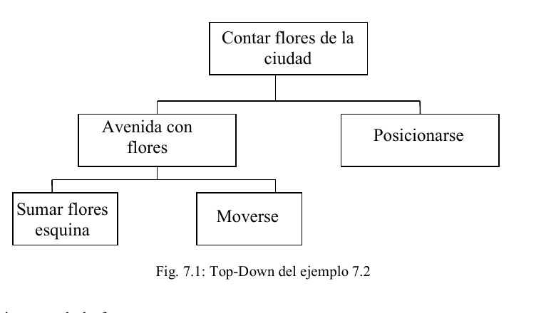

# Capítulo 7 - Parámetros de entrada/salida

## Objetivos

Continuando con los mecanismos de comunicación entre módulos se incorporarán en este capítulo los parámetros de entrada/salida que, como su nombre lo indica, permiten realizar un intercambio de información entre módulos, en ambos sentidos.

Este tipo de parámetros, si bien puede utilizarse en reemplazo de los parámetros de entrada, es recomendable utilizarlos solo en aquellos casos en que la comunicación entre los módulos lo justifique. De esta manera se reducirá la aparición de errores no deseados.

## Temas a tratar

- Introducción
- Ejemplos
- Otro uso de los Parámetros de Entrada/Salida.
- Conclusiones
- Ejercitación

## 7.1 Introducción

Un módulo utiliza un parámetro de entrada/salida cuando necesita recibir un dato, procesarlo y devolverlo modificado. También se utiliza para que un módulo pueda darle información al módulo que lo llamó.

El parámetro de entrada/salida permite realizar ambas operaciones sobre el mismo parámetro, ampliando de esta forma las posibilidades de comunicación.

Si bien este aspecto puede parecer ventajoso en primera instancia, es importante considerar que el uso de este tipo de parámetros resta independencia al módulo llamado ya que su funcionamiento depende de la información recibida.

## 7.2 Ejemplos

### Ejemplo 7.1

**Enunciado:** Programe al robot para que informe la cantidad total de flores que hay en la avenida 4. No se debe modificar la cantidad de flores de cada esquina.

```
programa Cap7Ejemplo1
procesos
  proceso SumarFloresEsquina (ES flores : numero)          {2}
  variables
    aux : numero
  comenzar
    aux:= 0
    mientras HayFlorEnLaEsquina
      tomarFlor
      aux:=aux+1
      flores:=flores+1
    repetir aux
      depositarFlor
  fin
areas
  ciudad: AreaC(1,1,100,100)
robots
  robot robot1
  variables
    totalFlores: numero
  comenzar
    Pos(4,1)
    totalFlores:=0
    repetir 99
      SumarFloresEsquina(totalFlores)                     {1}
      mover
    SumarFloresEsquina(totalFlores)                        {3}
    Informar(totalFlores)
  fin
variables
  R-info : robot1
comenzar
  AsignarArea(R-info,ciudad)
  Iniciar(R-info, 1 , 1)
fin
```

En Cap7Ejemplo1, el proceso `SumarFloresEsquina` recibe, en cada invocación, el total de flores encontradas hasta el momento y sobre este valor, continúa acumulando las flores. Esto puede verse en (1), donde al realizar la invocación se utiliza a `totalFlores` como parámetro. En (2) se especifica que este parámetro es de entrada/salida. Es decir, al comenzar la ejecución del proceso `SumarFloresEsquina`, este recibe en `flores` el valor del parámetro actual *totalFlores*, sobre este valor continúa acumulando la cantidad de flores encontradas y al finalizar, el valor del parámetro formal *flores* será devuelto al programa principal a través de *totalFlores*, reflejando de esta forma las modificaciones realizadas dentro del proceso.

Es importante ver que el objetivo del proceso `SumarFloresEsquina` es modificar la cantidad de flores encontradas hasta el momento sumándole la cantidad de flores de la esquina actual.

### Ejemplo 7.2

**Enunciado:** Programe al robot para que recorra todas las avenidas de la ciudad e informe la cantidad total de flores encontradas.

La descomposición Top-Down del problema se muestra en la figura 7.1



*Fig. 7.1: Top-Down del ejemplo 7.2*

El algoritmo es de la forma:

```
{Para cada avenida de la ciudad}
    {Recorrer la avenida incrementado la cant. de flores encontradas}
    {Posicionarse en la próxima avenida}
{Recorrer la última avenida}
{Informar el total de flores encontradas}
```

El programa utiliza dos módulos: uno para contar las flores de la esquina que ya fue definido en el ejemplo 7.1 y otro para recorrer la avenida.

El proceso que recorre la avenida es el siguiente:

```
proceso AvenidaConFlores( ES Total : numero )
variables
  cuantas : numero
comenzar
  repetir 99
    SumarFloresEsquina (cuantas)
    Total := Total + cuantas
    mover
  { esq. de la calle 100}
  SumarFloresEsquina (cuantas)
  Total := Total + cuantas
fin
```

Como puede verse, posee un parámetro de entrada/salida para registrar el total de flores del recorrido. Cada vez que el proceso es invocado recibe como entrada la cantidad de flores encontradas hasta el momento, sobre este valor agrega las flores de esta avenida y lo devuelve modificado. El programa completo es el siguiente:

```
programa Cap7Ejemplo2
procesos
  proceso SumarFloresEsquina (ES flores : numero)
  variables
    aux : numero
  comenzar
    aux:= 0
    mientras HayFlorEnLaEsquina
      tomarFlor
      aux:=aux+1
      flores:=flores+1
    repetir aux
      depositarFlor
  fin
  proceso AvenidaConFlores(ES Total : numero)
  variables
    cuantas : numero
  comenzar
    repetir 99
      cuantas := 0
      SumarFloresEsquina(cuantas)
      Total := Total + cuantas
      mover
    {Esquina de la calle 100}
    SumarFloresEsquina(cuantas)
    Total := Total + cuantas
  fin
areas
  ciudad: AreaC(1,1,100,100)
robots
  robot robot1
  variables
    totalFlores: numero
  comenzar
    totalFlores := 0                                       {1}
    repetir 99
      AvenidaConFlores(totalFlores)                        {2}
      Pos(PosAv + 1 , 1)
    AvenidaConFlores(totalFlores)
    Informar(totalFlores)                                  {3}
  fin
variables
  R-info : robot1
comenzar
  AsignarArea(R-info,ciudad)
  Iniciar(R-info, 1 , 1)
fin
```

En este código puede verse que, el determinar correctamente la cantidad de flores de la ciudad es responsabilidad tanto del robot R-info como del proceso AvenidaConFlores.

En (1) el robot asigna el valor 0 a la variable *TotFlores* como forma de representar que hasta el momento no se ha encontrado ninguna flor. En (2), al producirse la primer invocación al proceso avenida, se le envía el valor 0 que es recibido por el parámetro formal de entrada/salida, *total*. Durante la ejecución del proceso AvenidaConFlores, *total* se va incrementando con las flores encontradas en esa avenida. Al finalizar la avenida, se asigna este valor sobre el parámetro actual, *TotFlores*, permitiendo que el programa principal conozca la cantidad de flores encontradas en la avenida 1.

Luego de posicionarse en la avenida 2 se invoca nuevamente al proceso enviándole la cantidad de flores encontradas en la avenida 1. El proceso recibe esta cantidad y la incrementa con el total de flores de la avenida 2. Al finalizar, asigna nuevamente en *TotFlores* este valor permitiendo que el robot conozca la cantidad de flores encontradas en las primeras dos avenidas.

Esto se repite para las 98 avenidas restantes por lo cual en (3) se informará la cantidad de flores encontradas en todas avenidas de la ciudad.

### Ejemplo 7.3

**Enunciado:** Modifique la implementación del ejemplo 6.4 para que el robot informe al finalizar su recorrido, la cantidad total de vértices que tienen flores (al menos una).

El programa que sigue muestra la solución implementada:

```
programa Cap7Ejemplo3
procesos
  proceso Rectangulo (E base : numero; E altura : numero;
                       ES cantidad : numero)
  comenzar
    repetir 2
      si HayFlorEnLaEsquina
        cantidad := cantidad + 1
      repetir altura
        mover
      derecha
      si HayFlorEnLaEsquina
        cantidad := cantidad +1
      repetir base
        mover
      derecha
  fin
areas
  ciudad: AreaC(1,1,100,100)
robots
  robot robot1
  variables
    ancho, alto, cantVertices : numero
  comenzar
    cantVertices := 0                                      {1}
    ancho := 19
    alto := 5
    repetir 5
      Rectangulo(ancho,alto,cantVertices)                  {2}
      Pos(PosAv + 2, PosCa + alto)
      ancho := ancho - 4
      alto := alto - 1
    Informar(cantVertices)
  fin
variables
  R-info : robot1
comenzar
  AsignarArea(R-info,ciudad)
  Iniciar(R-info, 1 , 1)
fin
```

En el punto (1), cantVertices toma el valor 0, indicando que aún no se han encontrado flores en los vértices de ningún rectángulo.

En el punto (2), se invoca al proceso Rectangulo con tres parámetros. Los dos primeros, *ancho y alto,* definen las dimensiones del rectángulo y el tercer parámetro *cantVertices* representa el total de vértices con flor encontrados en el recorrido.

En este caso, el proceso Rectangulo posee dos parámetros de entrada, *base y altura,* en los cuales recibe los valores de los parámetros actuales *ancho y alto* del programa principal, respectivamente. Además, el proceso Rectangulo, posee un parámetro de entrada/salida, *cantidad,* utilizado para recibir la cantidad de vértices con flor encontrados hasta el momento e incorporarle la cantidad hallada en este rectángulo. Al terminar al proceso, el valor final de *cantidad* será asignado *a cantVertices* del robot.

Es importante hacer notar que, en las sucesivas invocaciones al proceso Rectangulo, como el dato *cantVertices* se relaciona con el parámetro de entrada/salida *cantidad*, este dato entra al proceso con el valor que indica la cantidad de vértices con flores encontrada hasta el momento. Durante la ejecución de este proceso podría modificarse su valor y el efecto se verá reflejado nuevamente en la variable *cantVertices* del robot.

## 7.3 Otro uso de los parámetros de Entrada/Salida.

Los parámetros de entrada/salida, por permitir la comunicación en ambos sentidos, pueden ser utilizados para reemplazar a los parámetros de entrada (aunque no es recomendable) ó bien para que únicamente retornen valores.

### Ejemplo 7.4

**Enunciado:** Programe al robot para que recorra la calle 10 e informe la cantidad total de esquinas que contienen exactamente 4 papeles.

Para resolver este problema podemos pensar en un proceso que cuenta los papeles de una esquina.

```
proceso ContarPapeles ( ES papeles :numero)
comenzar
  papeles:= 0
  mientras HayPapelEnLaEsquina
    tomarPapel
    papeles := papeles + 1
  repetir papeles
    depositarPapel
fin
```

Como podemos observar, el proceso ContarPapeles recibe el parámetro de entrada/salida *papeles* y lo primero que hace es inicializarlo en 0 para poder saber cuántos papeles hay en la esquina donde está parado. Al terminar la ejecución del proceso el parámetro *papeles* contiene la cantidad de papeles de esa esquina.

A continuación se presenta la solución completa en el ambiente de programación del robot R-info:

```
programa Cap7Ejemplo4
procesos
  proceso ContarPapeles (ES papeles : numero)
  comenzar
    papeles := 0
    mientras HayPapelEnLaEsquina
      tomarPapel
      papeles := papeles + 1
    repetir papeles
      depositarPapel
  fin
areas
  ciudad: AreaC(1,1,100,100)
robots
  robot robot1
  variables
    totalEsquina4Papeles, papelesEsquina : numero
  comenzar
    Pos(1,10)
    derecha
    totalEsquina4Papeles := 0                              {1}
    repetir 99
      ContarPapeles(papelesEsquina)                        {2}
      si (papelesEsquina = 4)                               {3}
        totalEsquina4Papeles := totalEsquina4Papeles + 1
      mover
    {Falta esquina 100 , 10}
    si papelesEsquina = 4
      totalEsquina4Papeles := totalEsquina4Papeles + 1
    Informar(totalEsquina4Papeles)
  fin
variables
  R-info : robot1
comenzar
  AsignarArea(R-info,ciudad)
  Iniciar(R-info, 1 , 1)
fin
```

En el punto (1) utilizamos una variable *totalEsquinas4Papeles* para saber cuántas esquinas tienen exactamente 4 papeles, inicializándola en 0 porque hasta ese momento no hemos contado nada. En (2), se invoca al proceso ContarPapeles con el parámetro formal *papelesEsquina* que no tiene ningún valor, pero como ya vimos, se inicializará en 0, ni bien comience a ejecutarse ese módulo. En el punto (3) se evalúa la cantidad de papeles de la esquina a través de *papelesEsquina* que devolvió el proceso ContarPapeles y si es 4 entonces se actualiza el contador *totalEsquinas4Papeles*.

### Ejemplo 7.5

**Enunciado:** Programe al robot para que informe la cantidad de calles que contienen más de 50 flores.

Se puede utilizar el módulo desarrollado en el ejemplo 7.1, el código sería el siguiente:

```
programa Cap7Ejemplo5
procesos
  proceso SumarFloresEsquina (ES flores : numero)          {1}
  comenzar
    { este proceso fue definido en el ejemplo 7.1 }
  fin
  proceso RecorrerCalle ( ES totalFlores : numero )        {2}
  comenzar
    totalFlores := 0
    repetir 99
      SumarFloresEsquina (totalFlores)
      mover
    SumarFloresEsquina (totalFlores)
  fin
areas
  ciudad: AreaC(1,1,100,100)
robots
  robot robot1
  variables
    floresCalle,totalCalle50Flores: numero
  comenzar
    derecha
    totalCalle50Flores := 0
    repetir 99
      RecorrerCalle(floresCalle)
      si floresCalle > 50
        totalCalle50Flores := totalCalle50Flores + 1
      Pos(1,PosCa +1)
    RecorrerCalle(floresCalle)
    si floresCalle > 50
      totalCalle50Flores := totalCalle50Flores + 1
    Informar(totalCalle50Flores)
  fin
variables
  R-info : robot1
comenzar
  AsignarArea(R-info,ciudad)
  Iniciar(R-info, 1 , 1)
fin
```

Notemos que en (1) y (2), los parámetros son de entrada/salida. En (1) el módulo utiliza el parámetro flores se utiliza como entrada y salida porque sobre este dato se va acumulando el total de flores de todas las esquinas de una calle. En cambio en (2) el módulo utiliza el parámetro TotalFlores únicamente como salida. Para un uso correcto de este parámetro, el programador no debe olvidar la inicialización al comenzar el proceso, porque de lo contrario podrían obtenerse resultados erróneos.

En resumen, un proceso que utiliza parámetros de entrada/salida como únicamente de salida es totalmente independiente del módulo que lo invoca. Cuando se usa el parámetro en este sentido, se trata de información generada dentro del proceso que se desea dar a conocer al módulo que lo llamó. En este caso no se busca un intercambio de información en ambos sentidos, solo el proceso es quien exporta datos.

> Haciendo clic en el siguiente link podés acceder a una animación con un ejemplo de análisis y resolución de un *Ejercicio con Parámetros*:
> Animación Ejercicio con Parámetros

## 7.4 Conclusiones

En este apunte se ha buscado introducir algunas ideas útiles a lo largo de la carrera en Informática:

1. Resultan de interés los problemas "solubles por computadora", es decir expresables como algoritmos.
2. No solo se debe entender como son los problemas, sino aprender a modelizarlos y a resolverlos en forma ordenada y sistemática.
3. No basta con tener UNA solución. Normalmente existen varias. La elegida debe ser EFICIENTE y además la forma en que esté escrita debe ser CLARA y ENTENDIBLE.

## Ejercitación

1. Escriba un programa que le permita al robot informar la cantidad total de flores y la cantidad total de papeles que hay en toda la ciudad. Para hacerlo, utilice un proceso que recorra una calle cuyo número recibe como parámetro y devuelva la información correspondiente.

<details><summary>Código</summary>

```
{Escriba un programa que le permita al robot informar la cantidad total de flores y la cantidad total de papeles que hay en toda la ciudad. Para hacerlo, utilice un proceso que recorra una calle cuyo número recibe como parámetro y devuelva la información correspondiente.}

programa  parametros
procesos
  proceso CONTARFLORPAPEL(ES flor:numero;ES papel:numero)
  comenzar
    mientras((HayFlorEnLaEsquina)|(HayPapelEnLaEsquina))
      si(HayPapelEnLaEsquina)
        tomarPapel
        papel:=papel+1
      si(HayFlorEnLaEsquina)
        tomarFlor
        flor:=flor+1
  fin
  proceso izquierda
  comenzar
    repetir 2
      derecha
  fin
  proceso Recorrer(ES NumFlores:numero;ES NumPapeles:numero;E calle:numero)
  variables
    CantFlores:numero
    num:numero
  comenzar
    num:=0
    Pos(1,calle)
    repetir 99
      repetir 99
        CONTARFLORPAPEL(NumFlores,NumPapeles)
        mover
      Pos(1,PosCa+1)
  fin
areas
  ciudad: AreaC(1,1,100,100)
robots
  robot robot1
  variables
    called:numero
    NFlores:numero
    NPapeles:numero
  comenzar
    NFlores:=0
    NPapeles:=0
    called:=1
    derecha
    Recorrer(NFlores,NPapeles,called)
    Informar(NFlores,NPapeles)
  fin
variables
  robin: robot1
comenzar
  AsignarArea(robin,ciudad)
  Iniciar(robin,1,1)
fin
```
</details>

2. El robot debe limpiar de flores las calles impares de la siguiente forma: toda flor que se encuentre en una calle impar debe ser trasladada a la calle par siguiente sobre la misma avenida. Por ejemplo si en (4,1) hay una flor, debe llevarse a (4,2). Al terminar el recorrido debe informar la cantidad total de flores que trasladó.

<details><summary>Código</summary>

```
{El robot debe limpiar de flores las calles impares de la siguiente forma: toda flor que se encuentre en una calle impar debe ser trasladada a la calle par siguiente sobre la misma avenida. Por ejemplo si en (4,1) hay una flor, debe llevarse a (4,2). Al terminar el recorrido debe informar la cantidad total de flores que trasladó.}

programa  parametros
procesos
  proceso izquierda
  comenzar
    repetir 3
      derecha
  fin
  proceso trasladar(ES flores:numero)
  variables
    numer:numero
  comenzar
    numer:=-1
    derecha
    flores:=0
    repetir 99
      mientras(HayFlorEnLaEsquina)
        tomarFlor
        flores:=flores+1
        Pos(PosAv,PosCa+1)
        depositarFlor
        Pos(PosAv,PosCa+numer)
      mover
  fin
areas
  ciudad: AreaC(1,1,100,100)
robots
  robot robot1
  variables
    hola:numero
  comenzar
    hola:=0
    repetir 99
      trasladar(hola)
      Pos(1,PosCa+2)
      izquierda
    Informar(hola)
  fin
variables
  robin: robot1
comenzar
  AsignarArea(robin,ciudad)
  Iniciar(robin,1,1)
fin
```
</details>

3. Escriba un programa para que el robot recorra la avenida 9 depositando en cada esquina lo que haga falta para que la cantidad de flores supere en 1 a la cantidad de papeles. Si no tiene en su bolsa lo necesario para hacerlo debe detener recorrido. Al finalizar debe informar la cantidad de esquinas que pudo completar adecuadamente. Si el recorrido quedo incompleto debe retornar a (9,1).

<details><summary>Código</summary>

```
{Escriba un programa para que el robot recorra la avenida 9 depositando en cada esquina lo que haga falta para que la cantidad de flores supere en 1 a la cantidad de papeles. Si no tiene en su bolsa lo necesario para hacerlo debe detener recorrido. Al finalizar debe informar la cantidad de esquinas que pudo completar adecuadamente. Si el recorrido quedo incompleto debe retornar a (9,1).}

programa Cap7Preg3
procesos
  proceso JuntarTodo(ES FLORES:numero;ES PAPELES:numero)
  comenzar
    mientras(HayFlorEnLaEsquina)|(HayPapelEnLaEsquina)
      si(HayFlorEnLaEsquina)
        tomarFlor
        FLORES:=FLORES+1
      si(HayPapelEnLaEsquina)
        tomarPapel
        PAPELES:=PAPELES+1
  fin
  proceso avenida(E NAvenida:numero;ES CantFlores:numero;ES CantPapeles:numero;ES CONTAR:numero)
  variables
    cero:numero
  comenzar
    cero:=-1
    Pos(NAvenida,1)
    mientras(CantPapeles>=CantFlores)&(HayPapelEnLaBolsa)
      depositarPapel
      CantPapeles:=CantPapeles+cero
    mientras(PosCa<100)&((HayPapelEnLaBolsa)&(HayFlorEnLaBolsa))
      depositarPapel
      depositarFlor
      CantFlores:=CantFlores+cero
      CantPapeles:=CantPapeles+cero
      mover
      CONTAR:=CONTAR+1
  fin
areas
  ciudad: AreaC(1,1,100,100)
robots
  robot robot1
  variables
    AVENIDA:numero
    flores:numero
    papeles:numero
    contar:numero
  comenzar
    contar:=0
    AVENIDA:=9
    flores:=0
    papeles:=0
    JuntarTodo(flores,papeles)
    Informar(flores,papeles)
    avenida(AVENIDA,flores,papeles,contar)
    Informar(AVENIDA,flores,papeles)
    Informar(contar)
  fin
variables
  robin:robot1
comenzar
  AsignarArea(robin,ciudad)
  Iniciar(robin,1,1)
fin
```
</details>

<details><summary>Código (variante CAP7PREG3)</summary>

```
{Variante de la Pregunta 3: escriba un programa para que el robot recorra la avenida 9 depositando en cada esquina lo que haga falta para que la cantidad de flores supere en 1 a la cantidad de papeles. Si no tiene en su bolsa lo necesario para hacerlo debe detener recorrido. Al finalizar debe informar la cantidad de esquinas que pudo completar adecuadamente. Si el recorrido quedo incompleto debe retornar a (9,1).}

programa Cap7Pregunta3
procesos
  proceso ContarF(ES FLORES:numero)
  variables
    ContFlores:numero
  comenzar 
    ContFlores:=0
    mientras(HayFlorEnLaEsquina)
      tomarFlor
      FLORES:=FLORES+1
      ContFlores:=ContFlores+1
    repetir ContFlores
      depositarFlor
  fin
  proceso ContarP(ES PAPELES:numero)
  variables
    ContP:numero
  comenzar
    ContP:=0
    mientras(HayFlorEnLaEsquina)
      tomarFlor
      PAPELES:=PAPELES+1
      ContP:=ContP+1
    repetir ContP
      depositarPapel
  fin
  proceso Esquina(ES seguir:boolean)
  variables
    flores,papeles:numero
  comenzar 
    ContarF(flores)
    ContarP(papeles)
    si(flores>papeles)
      DepoP(flores-papeles-1,seguir)
    sino
      DepoP(papeles-flores+1,seguir)
  fin
  proceso DepoP(E cantP:numero;E seguir:boolean)
  variables
    depo:numero
  comenzar
    depo:=0
    mientras(depo<cantP)&(HayFlorEnLaBolsa)
      depositarPapel
      depo:=depo+1
    si (depo<cantP)
      seguir:=F
  fin
areas
  ciudad:AreaC(1,1,100,100)
robots
  robot robot1
  variables
    seguir:boolean
    CantEsq:numero
  comenzar
    CantEsq:=0
    seguir:=V
    Esquina(seguir)
    mientras(seguir)&(PosCa<100)
      mover
      CantEsq:=CantEsq+1
      Esquina(seguir)
    si (seguir)
      CantEsq:=CantEsq+1
    sino
      Pos(9,1)
  fin
variables
  R-Info:robot1
comenzar
  AsignarArea(R-Info,ciudad)
  Iniciar(R-Info,1,1)
fin
```
</details>

4. Programe al robot para que recorra las calles de la ciudad. Por cada calle determine si debe depositar una flor ó un papel en cada esquina dependiendo si el total de flores de la calle es mayor o igual que el total de papeles (deposita una flor por cada esquina) o un papel en caso contrario. Al terminar el recorrido de todas las calles debe informar cuantas de las calles fueron completadas con flores.

<details><summary>Código</summary>

```
{Programe al robot para que recorra las calles de la ciudad. Por cada calle determine si debe depositar una flor ó un papel en cada esquina dependiendo si el total de flores de la calle es mayor o igual que el total de papeles (deposita una flor por cada esquina) o un papel en caso contrario. Al terminar el recorrido de todas las calles debe informar cuantas de las calles fueron completadas con flores.}

programa cap7Pregunta4
procesos
  proceso izquierda
  comenzar
    repetir 3
      derecha
  fin
  proceso CantidadEsquina(ES NPAPELES:numero;ES NFLORES:numero)
  comenzar
    mientras((HayPapelEnLaEsquina)|(HayFlorEnLaEsquina))
      si(HayPapelEnLaEsquina)
        tomarPapel
        NPAPELES:=NPAPELES+1
      si(HayFlorEnLaEsquina)
        tomarFlor
        NFLORES:=NFLORES+1
    repetir NPAPELES
      depositarPapel
    repetir NFLORES
      depositarFlor
  fin
  proceso SinModificar(ES Papeles:numero;ES Flores:numero)
  variables
    menos:numero
  comenzar
    menos:=-1
    CantidadEsquina(Papeles,Flores)
    mientras((Papeles<Flores)|(Papeles>Flores))&((HayFlorEnLaBolsa)|(HayPapelEnLaBolsa))
      si(Papeles>Flores)
        si(HayFlorEnLaBolsa)
          depositarFlor
          Flores:=Flores+1
      si(Papeles<Flores)
        si(HayPapelEnLaBolsa)
          depositarPapel
          Papeles:=Papeles+1
  fin
  proceso calle(ES PAPAPELES:numero;ES FLOFLORES:numero)
  comenzar
    derecha
    repetir 99
      PAPAPELES:=0
      FLOFLORES:=0
      SinModificar(PAPAPELES,FLOFLORES)
      mover
  fin
areas
  ciudad: AreaC(1,1,100,100)
robots
  robot robot1
  variables
    FLORES:numero
    PAPELES:numero
  comenzar
    repetir 99
      FLORES:=0
      PAPELES:=0
      calle(FLORES,PAPELES)
      Informar(PAPELES,FLORES)
      mover
    Informar(PAPELES,FLORES)
  fin
variables
  robin:robot1
comenzar
  AsignarArea(robin,ciudad)
  Iniciar(robin,1,1)
fin
```
</details>

5. Escriba un programa que le permita al robot recorrer las calles impares de la ciudad. Cada calle debe recorrerse sólo hasta encontrar una esquina con alguna flor o algún papel o ambos, que seguro existe. Al finalizar cada calle debe informarse cuantos pasos se ha dado hasta encontrar la esquina.

<details><summary>Código</summary>

```
{Escriba un programa que le permita al robot recorrer las calles impares de la ciudad. Cada calle debe recorrerse sólo hasta encontrar una esquina con alguna flor o algún papel o ambos, que seguro existe. Al finalizar cada calle debe informarse cuantos pasos se ha dado hasta encontrar la esquina.}

programa Capitulo7Pregunta5
procesos
  proceso izquierda
  comenzar
    repetir 3
      derecha
  fin
  proceso CallesImpares(ES contar:numero)
  comenzar
    derecha
    mientras(~(HayFlorEnLaEsquina))&(~(HayPapelEnLaEsquina))
      mover
      contar:=contar+1
    Informar(contar)
    Pos(1,PosCa+2)
    izquierda
  fin
areas
  ciudad:AreaC(1,1,100,100)
robots
  robot robot1
  variables
    contador:numero
  comenzar
    repetir 99
      contador:=0
      CallesImpares(contador)
  fin
variables
  R-Info:robot1
comenzar
  AsignarArea(R-Info,ciudad)
  Iniciar(R-Info,1,1)
fin
```
</details>

6. Escriba un programa que le permita al robot recorrer cuadrados hasta encontrar un cuadrado con exactamente 3 flores y 2 papeles (seguro existe). El primer cuadrado es de lado 99 y los siguientes van decrementando en uno el tamaño del lado (98, 97 y así sucesivamente).

<details><summary>Código</summary>

```
{Escriba un programa que le permita al robot recorrer cuadrados hasta encontrar un cuadrado con exactamente 3 flores y 2 papeles (seguro existe). El primer cuadrado es de lado 99 y los siguientes van decrementando en uno el tamaño del lado (98, 97 y así sucesivamente).}

programa Captitulo7Pregunta6
procesos
  proceso cuadrado(E Lado:numero;ES FLORES:numero;ES PAPELES:numero)
  variables
    CantPapeles:numero
    CantFlores:numero
  comenzar
    repetir 4
      repetir Lado
        CantFlores:=0
        CantPapeles:=0
        mientras(HayFlorEnLaEsquina)|(HayPapelEnLaEsquina)
          si(HayFlorEnLaEsquina)
            tomarFlor
            FLORES:=FLORES+1
            CantFlores:=CantFlores+1
          si(HayPapelEnLaEsquina)
            tomarPapel
            PAPELES:=PAPELES+1
            CantPapeles:=CantPapeles+1
        repetir CantFlores
          depositarFlor
        repetir CantPapeles
          depositarPapel
        mover
      derecha
  fin
areas
  ciudad:AreaC(1,1,100,100)
robots
  robot robot1
  variables
    lado,flores:numero
    papeles:numero
    menos:numero
  comenzar
    menos:=-1
    lado:=14
    mientras(~(flores=3)&~(papeles=2))
      flores:=0
      papeles:=0
      cuadrado(lado,flores,papeles)
      lado:=lado+menos
      Informar(lado,flores,papeles)
  fin
variables
  R-Info: robot1
comenzar
  AsignarArea(R-Info,ciudad)
  Iniciar(R-Info,1,1)
fin
```
</details>

### Código relacionado con la ejercitación

| Ejercicio | Implementación disponible |
|---|---|
| 1 | [Cap7_Preg_1](codigo/soluciones/capitulo-07/Cap7_Preg_1) |
| 2 | [Cap7_Preg_2](codigo/soluciones/capitulo-07/Cap7_Preg_2) |
| 3 | [Cap7_Preg_3](codigo/soluciones/capitulo-07/Cap7_Preg_3) y [variante CAP7PREG3](codigo/soluciones/capitulo-07/CAP7PREG3) |
| 4 | [Cap7_Preg_4](codigo/soluciones/capitulo-07/Cap7_Preg_4) |
| 5 | [Cap7_Preg_5](codigo/soluciones/capitulo-07/Cap7_Preg_5) |
| 6 | [Cap7_Preg_6](codigo/soluciones/capitulo-07/Cap7_Preg_6) |

Ejemplos complementarios: [caso básico](codigo/ejemplos/parametros-entrada-salida/basico.ri), [ejemplo 1](codigo/ejemplos/parametros-entrada-salida/ejemplo_1.ri), [ejemplo 2](codigo/ejemplos/parametros-entrada-salida/ejemplo_2.ri), [ejemplo 3](codigo/ejemplos/parametros-entrada-salida/ejemplo_3.ri), [ejemplo 4](codigo/ejemplos/parametros-entrada-salida/ejemplo_4.ri) y [ejemplo 5](codigo/ejemplos/parametros-entrada-salida/ejemplo_5.ri).
