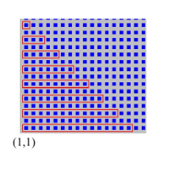

# Ejercicio adicional 3: recorrido escalonado juntando todas las flores y papeles

## Enunciado

Escriba un programa que le permita al robot realizar el siguiente recorrido, comenzando en la esquina (1,1) juntando todas las flores y papeles de cada esquina. Al finalizar el recorrido debe informar la cantidad total de flores y de papeles que tiene en la bolsa.

**Nota:** Se debe usar Modularización.

**Descripción accesible:** grilla de esquinas con un recorrido rojo en forma de escalera: la fila que arranca en (1,1) es la más larga (18 esquinas de avance) y las filas siguientes, cada una dos calles más arriba, se angostan de a dos esquinas hasta terminar en una única esquina.

## Datos

- **Entradas:** ninguna leída en tiempo de ejecución.
- **Salidas:** dos `Informar`: cantidad total de flores y cantidad total de papeles recogidos.
- **Restricciones:** el recorrido tiene una forma específica (escalonada, ilustrada en la figura), comienza en (1,1).

## Referencias

- Solución: [`../soluciones/ejercicio-03-recorrido-escalonado-juntando-todo.md`](../soluciones/ejercicio-03-recorrido-escalonado-juntando-todo.md)
- Código: [`../codigo/ejercicio-03.ri`](../codigo/ejercicio-03.ri)
- Versión guiada: [`../practica-guiada.md`](../practica-guiada.md)
