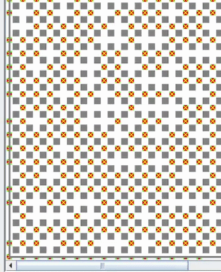
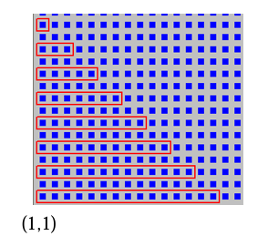

# Ejercicios Adicionales (versión guiada con código y animaciones)

> Presentación alternativa de los primeros tres ejercicios de [ejercicios-adicionales.md](ejercicios-adicionales.md), con código resuelto y animación del recorrido. Los enunciados 4 a 8 de esa práctica no tienen versión guiada.

## 1️⃣ Ejercicio

Escriba un programa que le permita al robot recorrer todas las avenidas de la ciudad.

Cada avenida debe recorrerse **solo hasta encontrar una esquina vacía** (sin flor ni papel), que seguro existe.

Además, mientras recorre cada avenida, debe **informar si la misma tuvo a lo sumo 45 flores** (hasta que encontró la esquina).

**Nota:** Se debe usar **Modularización**.

<details><summary>Codigo</summary>

```
programa Cap7Ejercicio1

procesos
  {Devuelve en totalFlores la cantidad de flores encontradas hasta esa esquina vacía.}
  proceso RecorrerAvenidaHastaVacia (ES totalFlores: numero)
  comenzar
    mientras (HayFlorEnLaEsquina | HayPapelEnLaEsquina)
      mientras HayFlorEnLaEsquina
        tomarFlor
        totalFlores := totalFlores + 1
      mover
  fin

  {Informa 1 si la avenida tuvo a lo sumo 45 flores, sino informa 0}
  proceso InformarAvenida (E floresAvenida: numero)
  comenzar
    si (floresAvenida <= 45)
      Informar(1)
    sino
      Informar(0)
  fin


areas
  ciudad: AreaC(1,1,100,100)

robots
  robot robot1
  variables
    floresAvenida: numero
  comenzar
    {Arranca mirando hacia el norte (de calle 1 hacia 100)}
    
    {Avenidas 1 a 99}
    repetir 9
      floresAvenida := 0
      RecorrerAvenidaHastaVacia(floresAvenida)
      InformarAvenida(floresAvenida)
      Pos(PosAv + 1, 1)

    {Avenida 100}
    RecorrerAvenidaHastaVacia(floresAvenida)
    InformarAvenida(floresAvenida)
  fin

variables
  R-info: robot1

comenzar
  AsignarArea(R-info, ciudad)
  Iniciar(R-info, 1, 1)
fin
```
</details>

### Resultado



---

## 2️⃣ Ejercicio

Escriba un programa que le permita al robot recorrer **todas las avenidas de la ciudad**.

Al finalizar el recorrido debe informar:

- La **cantidad de esquinas con exactamente 20 flores**.
- La **cantidad de avenidas con menos de 60 papeles**.

**Nota:**  
Se debe usar **Modularización** y **no modificar la cantidad de papeles ni flores de las esquinas**.

<details><summary>Codigo</summary>

```
{Escriba un programa que le permita al robot recorrer todas las avenidas de la ciudad. Al finalizar el recorrido debe informar la cantidad de esquinas con exactamente 20 flores y la cantidad avenidas con menos de 60 papeles.

Nota: Se debe usar Modularización y no modificar la cantidad de papeles/flores de las esquinas.}

programa EjAdic2

procesos

  {Cuenta flores de la esquina SIN modificar (toma y repone)}
  proceso ContarFloresEsquina (ES flores: numero)
  variables
    aux: numero
  comenzar
    aux := 0
    mientras HayFlorEnLaEsquina
      tomarFlor
      aux := aux + 1
    repetir aux
      depositarFlor
    flores := flores + aux
  fin

  {Cuenta papeles de la esquina SIN modificar (toma y repone)}
  proceso ContarPapelesEsquina (ES papeles: numero)
  variables
    aux: numero
  comenzar
    aux := 0
    mientras HayPapelEnLaEsquina
      tomarPapel
      aux := aux + 1
    repetir aux
      depositarPapel
    papeles := papeles + aux
  fin

  {Procesa una avenida completa (desde calle 1 hasta 100)
   - suma esquinas con 20 flores al contador global
   - calcula papeles totales de la avenida y si <60 suma 1 a avenidasMenos60}
  proceso ProcesarAvenida (ES esquinas20: numero; ES avenidasMenos60: numero)
  variables
    papelesAvenida, floresEsq, papelesEsq: numero
  comenzar
    papelesAvenida := 0

    repetir 99
      floresEsq := 0
      ContarFloresEsquina(floresEsq)
      si (floresEsq = 20)
        esquinas20 := esquinas20 + 1

      papelesEsq := 0
      ContarPapelesEsquina(papelesEsq)
      papelesAvenida := papelesAvenida + papelesEsq

      mover

    {Esquina de la calle 100 (la última, sin mover)}
    floresEsq := 0
    ContarFloresEsquina(floresEsq)
    si (floresEsq = 20)
      esquinas20 := esquinas20 + 1

    papelesEsq := 0
    ContarPapelesEsquina(papelesEsq)
    papelesAvenida := papelesAvenida + papelesEsq

    si (papelesAvenida < 60)
      avenidasMenos60 := avenidasMenos60 + 1
  fin


areas
  ciudad: AreaC(1,1,100,100)

robots
  robot robot1
  variables
    totalEsquinas20, totalAvenidasMenos60: numero
  comenzar
    totalEsquinas20 := 0
    totalAvenidasMenos60 := 0

    {Avenidas 1 a 99}
    repetir 9
      ProcesarAvenida(totalEsquinas20, totalAvenidasMenos60)
      Pos(PosAv + 1, 1)

    {Avenida 100}
    ProcesarAvenida(totalEsquinas20, totalAvenidasMenos60)

    Informar(totalEsquinas20)
    Informar(totalAvenidasMenos60)
  fin

variables
  R-info: robot1

comenzar
  AsignarArea(R-info, ciudad)
  Iniciar(R-info, 1, 1)
fin
```
</details>

---

## 3️⃣ Ejercicio

Escriba un programa que le permita al robot realizar el siguiente recorrido:

- Comenzando en la **esquina (1,1)**.
- Juntando **todas las flores y papeles de cada esquina**.

Al finalizar el recorrido debe informar:

- La **cantidad total de flores**.
- La **cantidad total de papeles** que tiene en la bolsa.

**Nota:** Se debe usar **Modularización**.

<details><summary>Codigo</summary>

```
{Escriba un programa que le permita al robot realizar el siguiente recorrido, comenzando en la esquina (1,1) juntando todas las flores y papeles de cada esquina. Al finalizar el recorrido debe informar la cantidad total de flores y de papeles que tiene en la bolsa.

Nota: Se debe usar Modularización.}

programa EjAdic3

procesos

  {Junta TODO lo de la esquina y acumula en contadores}
  proceso JuntarEsquina (ES totalF: numero; ES totalP: numero)
  comenzar
    mientras HayFlorEnLaEsquina
      tomarFlor
      totalF := totalF + 1
    mientras HayPapelEnLaEsquina
      tomarPapel
      totalP := totalP + 1
  fin

  proceso Izquierda
  comenzar
    repetir 3
      derecha
  fin
  proceso RecorrerFila (E pasos: numero; ES totalF: numero; ES totalP: numero)
  comenzar
    JuntarEsquina(totalF, totalP)

    repetir pasos
      mover
      JuntarEsquina(totalF, totalP)

    Izquierda
    mover
    JuntarEsquina(totalF, totalP)
    Izquierda
    repetir pasos
      mover
      JuntarEsquina(totalF, totalP)
    Izquierda
    JuntarEsquina(totalF, totalP)
    mover
    Izquierda
  fin


areas
  ciudad: AreaC(1,1,100,100)

robots
  robot robot1
  variables
    totalFlores, totalPapeles: numero
    pasos: numero
  comenzar
    totalFlores := 0
    totalPapeles := 0
  
    pasos := 18
    derecha
    repetir 9
      RecorrerFila(pasos, totalFlores, totalPapeles)
      pasos := pasos - 2
      Pos(1, PosCa+ 2)
  fin

variables
  R-info: robot1

comenzar
  AsignarArea(R-info, ciudad)
  Iniciar(R-info, 1, 1)
fin
```
</details>


