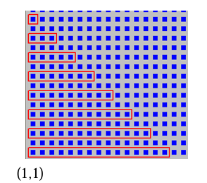

# Ejercicios Adicionales

## 1️⃣ Ejercicio

Escriba un programa que le permita al robot recorrer todas las avenidas de la ciudad.

Cada avenida debe recorrerse **solo hasta encontrar una esquina vacía** (sin flor ni papel), que seguro existe.

Además, mientras recorre cada avenida, debe **informar si la misma tuvo a lo sumo 45 flores** (hasta que encontró la esquina).

**Nota:** Se debe usar **Modularización**.

---

## 2️⃣ Ejercicio

Escriba un programa que le permita al robot recorrer **todas las avenidas de la ciudad**.

Al finalizar el recorrido debe informar:

- La **cantidad de esquinas con exactamente 20 flores**.
- La **cantidad de avenidas con menos de 60 papeles**.

**Nota:**  
Se debe usar **Modularización** y **no modificar la cantidad de papeles ni flores de las esquinas**.

---

## 3️⃣ Ejercicio

Escriba un programa que le permita al robot realizar el siguiente recorrido:

- Comenzando en la **esquina (1,1)**.
- Juntando **todas las flores y papeles de cada esquina**.

Al finalizar el recorrido debe informar:

- La **cantidad total de flores**.
- La **cantidad total de papeles** que tiene en la bolsa.

**Nota:** Se debe usar **Modularización**.

