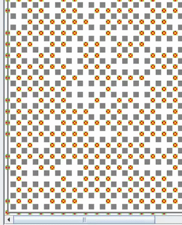

# Ejercicios Adicionales

## 1️⃣ Ejercicio

Escriba un programa que le permita al robot recorrer todas las avenidas de la ciudad.

Cada avenida debe recorrerse **solo hasta encontrar una esquina vacía** (sin flor ni papel), que seguro existe.

Además, mientras recorre cada avenida, debe **informar si la misma tuvo a lo sumo 45 flores** (hasta que encontró la esquina).

**Nota:** Se debe usar **Modularización**.

<details><summary>Codigo</summary>

```
programa Cap7Ejercicio1

procesos
  {Devuelve en totalFlores la cantidad de flores encontradas hasta esa esquina vacía.}
  proceso RecorrerAvenidaHastaVacia (ES totalFlores: numero)
  comenzar
    mientras (HayFlorEnLaEsquina | HayPapelEnLaEsquina)
      mientras HayFlorEnLaEsquina
        tomarFlor
        totalFlores := totalFlores + 1
      mover
  fin

  {Informa 1 si la avenida tuvo a lo sumo 45 flores, sino informa 0}
  proceso InformarAvenida (E floresAvenida: numero)
  comenzar
    si (floresAvenida <= 45)
      Informar(1)
    sino
      Informar(0)
  fin


areas
  ciudad: AreaC(1,1,100,100)

robots
  robot robot1
  variables
    floresAvenida: numero
  comenzar
    {Arranca mirando hacia el norte (de calle 1 hacia 100)}
    
    {Avenidas 1 a 99}
    repetir 9
      floresAvenida := 0
      RecorrerAvenidaHastaVacia(floresAvenida)
      InformarAvenida(floresAvenida)
      Pos(PosAv + 1, 1)

    {Avenida 100}
    RecorrerAvenidaHastaVacia(floresAvenida)
    InformarAvenida(floresAvenida)
  fin

variables
  R-info: robot1

comenzar
  AsignarArea(R-info, ciudad)
  Iniciar(R-info, 1, 1)
fin
```
</details>

### Resultado



---

## 2️⃣ Ejercicio

Escriba un programa que le permita al robot recorrer **todas las avenidas de la ciudad**.

Al finalizar el recorrido debe informar:

- La **cantidad de esquinas con exactamente 20 flores**.
- La **cantidad de avenidas con menos de 60 papeles**.

**Nota:**  
Se debe usar **Modularización** y **no modificar la cantidad de papeles ni flores de las esquinas**.


---

## 3️⃣ Ejercicio

Escriba un programa que le permita al robot realizar el siguiente recorrido:

- Comenzando en la **esquina (1,1)**.
- Juntando **todas las flores y papeles de cada esquina**.

Al finalizar el recorrido debe informar:

- La **cantidad total de flores**.
- La **cantidad total de papeles** que tiene en la bolsa.

**Nota:** Se debe usar **Modularización**.

