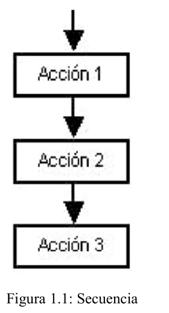
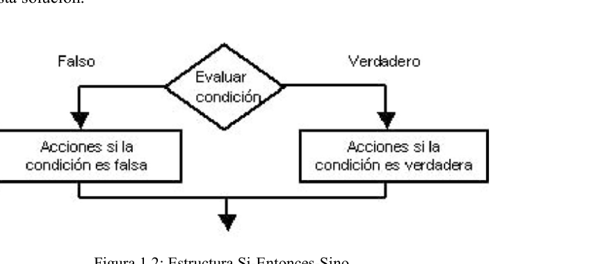
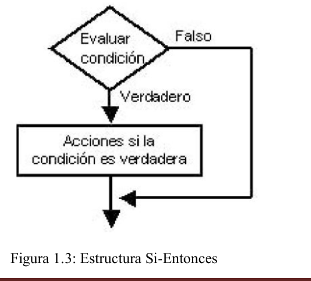
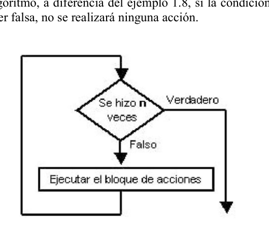
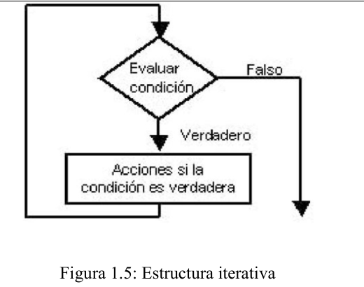

# Capítulo 1 - Resolución de problemas

## Objetivos

La resolución de problemas, utilizando como herramienta una computadora, requiere contar con la capacidad de expresión suficiente como para indicar a la máquina lo que debe llevarse a cabo.

Se comenzará resolviendo situaciones del mundo real tratando de utilizar determinados elementos que caracterizan a una secuencia de órdenes que una computadora puede comprender.

El tema central de este capítulo es la definición del concepto de algoritmo y los elementos que lo componen.

## Temas a tratar

- Introducción.
- Etapas en la resolución de problemas con computadora.
- Algoritmo.
- Pre y Postcondiciones de un algoritmo.
- Elementos que componen un algoritmo: Secuencia de Acciones, Selección, Repetición e Iteración.
- Importancia de la indentación en las estructuras de control.
- Conclusiones.
- Ejercitación.

## 1.1 Introducción

> La Informática es la ciencia que estudia el análisis y resolución de problemas utilizando computadoras.

La palabra ciencia se relaciona con una metodología fundamentada y racional para el estudio y resolución de los problemas. En este sentido la Informática se vincula especialmente con la Matemática.

Si se busca en el diccionario una definición en la palabra *problema* podrá hallarse alguna de las siguientes:

- Cuestión o proposición dudosa, que se trata de aclarar o resolver.
- Enunciado encaminado a averiguar el modo de obtener un resultado cuando se conocen ciertos datos.

La resolución de problemas mediante una computadora consiste en dar una adecuada formulación de pasos precisos a seguir.

Si se piensa en la forma en que una persona indica a otra como resolver un problema, se verá que habitualmente se utiliza un lenguaje común y corriente para realizar la explicación, quizá entremezclado con algunas palabras técnicas. Esto es un riesgo muy grande. Los que tienen cierta experiencia al respecto saben que es difícil transmitir el mensaje y por desgracia, con mucha frecuencia se malinterpretan las instrucciones y por lo tanto se ejecuta incorrectamente la solución obteniéndose errores.

Cuando de una computadora se trata, no pueden utilizarse indicaciones ambiguas. Ante cada orden resulta fundamental tener una única interpretación de lo que hay que realizar. Una máquina no posee la capacidad de decisión del ser humano para resolver situaciones no previstas. Si al dar una orden a la computadora se produce una situación no contemplada, será necesario abortar esa tarea y recomenzar todo el procedimiento nuevamente.

Además, para poder indicar a la computadora las órdenes que debe realizar es necesario previamente entender exactamente lo que se quiere hacer. Es fundamental conocer con qué información se cuenta y qué tipo de transformación se quiere hacer sobre ella.

A continuación se analizarán en forma general las distintas etapas que deben seguirse para poder llegar a resolver un problema utilizando una computadora como herramienta.

## 1.2 Etapas en la resolución de problemas con computadora

La resolución de problemas utilizando como herramienta una computadora no se resume únicamente en la escritura de un programa, sino que se trata de una tarea más compleja. El proceso abarca todos los aspectos que van desde interpretar las necesidades del usuario hasta verificar que la respuesta brindada es correcta. Las etapas son las siguientes:

### Análisis del problema

En esta primera etapa, se analiza el problema en su contexto del mundo real. Deben obtenerse los requerimientos del usuario. El resultado de este análisis es un modelo preciso del ambiente del problema y del objetivo a resolver. Dos componentes importantes de este modelo son los datos a utilizar y las transformaciones de los mismos que llevan al objetivo.

### Diseño de una solución

La resolución de un problema suele ser una tarea muy compleja para ser analizada como un todo. Una técnica de diseño en la resolución de problemas consiste en la identificación de las partes (subproblemas) que componen el problema y la manera en que se relacionan. Cada uno de estos subproblemas debe tener un objetivo específico, es decir, debe resolver una parte del problema original. La integración de las soluciones de los subproblemas es lo que permitirá obtener la solución buscada.

### Especificación de algoritmos

La solución de cada subproblema debe ser especificada a través de un algoritmo. Esta etapa busca obtener la secuencia de pasos a seguir para resolver el problema. La elección del algoritmo adecuado es fundamental para garantizar la eficiencia de la solución.

### Escritura de programas

Un algoritmo es una especificación simbólica que debe convertirse en un programa real sobre un lenguaje de programación concreto. A su vez, un programa escrito en un lenguaje de programación determinado (ej: Pascal, Ada, etc) es traducido automáticamente al lenguaje de máquina de la computadora que lo va a ejecutar. Esta traducción, denominada compilación, permite detectar y corregir los errores sintácticos que se cometan en la escritura del programa.

### Verificación

Una vez que se tiene un programa escrito en un lenguaje de programación se debe verificar que su ejecución produce el resultado deseado, utilizando datos representativos del problema real. Sería deseable poder afirmar que el programa cumple con los objetivos para los cuales fue creado, más allá de los datos particulares de una ejecución. Sin embargo, en los casos reales es muy difícil realizar una verificación exhaustiva de todas las posibles condiciones de ejecución de un sistema de software. La facilidad de verificación y la depuración de errores de funcionamiento del programa conducen a una mejor calidad del sistema y es un objetivo central de la Ingeniería de Software.

En cada una de las etapas vistas se pueden detectar errores lo cual lleva a revisar aspectos de la solución analizados previamente.

Dada la sencillez de los problemas a resolver en este curso, la primera etapa correspondiente al análisis del problema, sólo se verá reflejada en la interpretación del enunciado a resolver. Sin embargo, a lo largo de la carrera se presentarán diferentes asignaturas que permitirán familiarizar al alumno con las técnicas necesarias para hacer frente a problemas de gran envergadura.

Con respecto a la segunda etapa, se pospondrá el análisis de este tema hasta el capítulo 5, ya que se comenzará a trabajar con problemas simples que no necesitan ser descompuestos en otros más elementales.

Por lo tanto, a continuación se trabajará sobre el concepto de algoritmo como forma de especificación de soluciones concretas para la resolución de problemas con computadora.

## 1.3 Algoritmo

La palabra algoritmo deriva del nombre de un matemático árabe del siglo IX, llamado Al-Khuwarizmi, quien estaba interesado en resolver ciertos problemas de aritmética y describió varios métodos para resolverlos. Estos métodos fueron presentados como una lista de instrucciones específicas (como una receta de cocina) y su nombre es utilizado para referirse a dichos métodos.

Un algoritmo es, en forma intuitiva, una receta, un conjunto de instrucciones o de especificaciones sobre un proceso para hacer algo. Ese algo generalmente es la solución de un problema de algún tipo. Se espera que un algoritmo tenga varias propiedades. La primera es que un algoritmo no debe ser ambiguo, o sea, que si se trabaja dentro de cierto marco o contexto, cada instrucción del algoritmo debe significar sólo una cosa.

Se presentan a continuación algunos ejemplos:

#### Ejemplo 1.1

**Problema**: Indique la manera de salar una masa.

**Algoritmo 1**: Ponerle algo de sal a la masa

**Algoritmo 2**: Agregarle una cucharadita de sal a la masa.

El algoritmo 1 presenta una solución ambigua al problema planteado.
El algoritmo 2 presenta una solución adecuada al problema.

#### Ejemplo 1.2

**Problema**: Determinar si el número 7317 es primo.

**Algoritmo 1**: Divida el 7317 entre sus anteriores buscando aquellos que lo dividan exactamente.

**Algoritmo 2**: Divida el número 7317 entre cada uno de los números 1, 2, 3, 4, ..., 7315, 7316. Si una de las divisiones es exacta, la respuesta es no. Si no es así, la respuesta es sí.

El algoritmo 1 no especifica claramente cuáles son los valores a lo que se refiere, por lo que resulta ambiguo.

El algoritmo 2 presenta una solución no ambigua para este problema. Existen otros algoritmos mucho más eficaces para dicho problema, pero esta es una de las soluciones correctas.

#### Ejemplo 1.3

**Problema**: Determinar la suma de todos los números enteros.

En este caso no se puede determinar un algoritmo para resolver este problema. Un algoritmo debe alcanzar la solución en un tiempo finito, situación que no se cumplirá en el ejemplo ya que los números enteros son infinitos.

Además de no ser ambiguo, un algoritmo debe detenerse. Se supone también que cuando se detiene, debe informar de alguna manera, su resultado. Es bastante factible escribir un conjunto de instrucciones que no incluyan una terminación y por lo tanto dicho conjunto de instrucciones no conformarían un algoritmo.

#### Ejemplo 1.4

**Problema**: Volcar un montículo de arena en una zanja.

**Algoritmo**: Tome una pala. Mientras haya arena en el montículo cargue la pala con arena y vuélquela en la zanja. Dejar la pala.

Este algoritmo es muy simple y no ambiguo. Se está seguro que en algún momento parará, aunque no se sabe cuántas paladas se requerirán.

> Resumiendo, un algoritmo puede definirse como una secuencia ordenada de pasos elementales, exenta de ambigüedades, que lleva a la solución de un problema dado en un tiempo finito.

Para comprender totalmente la definición anterior falta clarificar que se entiende por "paso elemental".

#### Ejemplo 1.5

Escriba un algoritmo que permita preparar una tortilla de papas de tres huevos.

El enunciado anterior basta para que un cocinero experto lo resuelva sin mayor nivel de detalle, pero si este no es el caso, se deben describir los pasos necesarios para realizar la preparación. Esta descripción puede ser:

```
Mezclar papas cocidas, huevos y una pizca de sal en un recipiente
Freír
```

Esto podría resolver el problema, si el procesador o ejecutor del mismo no fuera una persona que da sus primeros pasos en tareas culinarias, ya que el nivel de detalle del algoritmo presupone muchas cosas.

Si este problema debe resolverlo una persona que no sabe cocinar, se debe detallar, cada uno de los pasos mencionados, pues estos no son lo bastante simples para un principiante.

De esta forma, el primer paso puede descomponerse en:

```
Pelar las papas
Cortarlas en cuadraditos
Cocinar las papas
Batir los huevos en un recipiente
Agregar las papas al recipiente y echar una pizca de sal al mismo
```

El segundo paso (freír) puede descomponerse en los siguientes tres:

```
Calentar el aceite en la sartén
Verter el contenido del recipiente en la sartén
Dorar la tortilla de ambos lados
```

Nótese además que si la tortilla va a ser realizada por un niño, algunas tareas (por ejemplo batir los huevos) pueden necesitar una mejor especificación.

El ejemplo anterior sólo pretende mostrar que la lista de pasos elementales que compongan nuestro algoritmo depende de quién sea el encargado de ejecutarlo.

Si en particular, el problema va a ser resuelto utilizando una computadora, el conjunto de pasos elementales conocidos es muy reducido, lo que implica un alto grado de detalle para los algoritmos.

> Se considera entonces como un paso elemental aquel que no puede volver a ser dividido en otros más simples. De ahora en adelante se utilizará la palabra instrucción como sinónimo de paso elemental.

Un aspecto importante a discutir es el detalle que debe llevar el algoritmo. Esto no debe confundirse con el concepto anterior de paso elemental. En ocasiones, no se trata de descomponer una orden en acciones más simples sino que se busca analizar cuáles son las órdenes relevantes para el problema. Esto resulta difícil de cuantificar cuando las soluciones son expresadas en lenguaje natural. Analice el siguiente ejemplo:

#### Ejemplo 1.6

Desarrolle un algoritmo que describa la manera en que Ud. se levanta todas las mañanas para ir al trabajo.

```
Salir de la cama
Quitarse el pijama
Ducharse
Vestirse
Desayunar
Arrancar el auto para ir al trabajo
```

Nótese que se ha llegado a la solución del problema en seis pasos, y no se resaltan aspectos como: colocarse un calzado después de salir de la cama, o abrir la llave de la ducha antes de ducharse. Estos aspectos han sido descartados, pues no tienen mayor trascendencia. En otras palabras se sobreentienden o se suponen. A nadie se le ocurriría ir a trabajar descalzo.

En cambio existen aspectos que no pueden obviarse o suponerse porque el algoritmo perdería lógica. El tercer paso, "vestirse", no puede ser omitido. Puede discutirse si requiere un mayor nivel de detalle o no, pero no puede ser eliminado del algoritmo.

Un buen desarrollador de algoritmos deberá reconocer esos aspectos importantes y tratar de simplificar su especificación de manera de seguir resolviendo el problema con la menor cantidad de órdenes posibles.

## 1.4 Pre y Postcondiciones de un algoritmo

> Precondición es la información que se conoce como verdadera antes de comenzar el algoritmo.

### En el ejemplo 1.1

**Problema**: Indique la manera de salar una masa.

**Algoritmo**: Agregarle una cucharadita de sal a la masa.

Se supone que se dispone de todos los elementos para llevar a cabo esta tarea. Por lo tanto, como precondición puede afirmarse que se cuenta con la cucharita, la sal y la masa.

> Postcondición es la información que se conoce como verdadera al concluir el algoritmo si se cumple adecuadamente el requerimiento pedido.

### En el ejemplo 1.2

**Problema**: Determinar si el número 7317 es primo.

**Algoritmo**: Divida el número 7317 entre cada uno de los números 1, 2, 3, 4, ..., 7315, 7316. Si una de las divisiones es exacta, la respuesta es no. Si no es así, la respuesta es sí.

La postcondición es que se ha podido determinar si el número 7317 es primo o no.

### En el ejemplo 1.4

**Problema**: Volcar un montículo de arena en una zanja.

**Algoritmo**: Tome una pala. Mientras haya arena en el montículo cargue la pala con arena y vuélquela en la zanja. Dejar la pala.

> ¿Cuáles serían las precondiciones y las postcondiciones del algoritmo?
>
> La precondición es que se cuenta con la pala, la arena y está ubicado cerca de la zanja que debe llenar.

La postcondición es que el montículo quedó vació al terminar el algoritmo.

## 1.5 Elementos que componen un algoritmo

### 1.5.1 Secuencia de Acciones

> Una secuencia de acciones está formada por una serie de instrucciones que se ejecutan una a continuación de la otra.

Esto se muestra gráficamente en la figura 1.1


*Figura 1.1: Secuencia*

#### Ejemplo 1.7

Escriba un algoritmo que permita cambiar una lámpara quemada.

```
Colocar la escalera debajo de la lámpara quemada
Tomar una lámpara nueva de la misma potencia que la anterior
Subir por la escalera con la nueva lámpara hasta alcanzar la lámpara a sustituir
Desenroscar la lámpara quemada
Enroscar la nueva lámpara hasta que quede apretada la nueva lámpara
Bajar de la escalera con lámpara quemada
Tirar la lámpara a la basura
```

#### Ejemplo 1.8

Escriba un algoritmo que permita a un robot subir 8 escalones

```
Levantar Pie Izquierdo
Subir un escalón
Levantar Pie Derecho
Subir un escalón
Levantar Pie Izquierdo
Subir un escalón
Levantar Pie Derecho
Subir un escalón
Levantar Pie Izquierdo
Subir un escalón
Levantar Pie Derecho
Subir un escalón
Levantar Pie Izquierdo
Subir un escalón
Levantar Pie Derecho
Subir un escalón
```

> Se denomina flujo de control de un algoritmo al orden en el cual deben ejecutarse los pasos individuales.

Hasta ahora se ha trabajado con flujo de control secuencial, es decir, la ejecución uno a uno de los pasos, desde el primero hasta el último.

> Las estructuras de control son construcciones algorítmicas que alteran directamente el flujo de control secuencial del algoritmo.

Con ellas es posible seleccionar un determinado sentido de acción entre un par de alternativas específicas o repetir automáticamente un grupo de instrucciones.

A continuación se presentan las estructuras de control necesarias para la resolución de problemas más complejos.

### 1.5.2 Selección

La escritura de soluciones a través de una secuencia de órdenes requiere conocer a priori las diferentes alternativas que se presentarán en la resolución del problema. Lamentablemente, es imposible contar con esta información antes de comenzar la ejecución de la secuencia de acciones.

Por ejemplo, que ocurriría si en el ejemplo 1.7 al querer sacar la lámpara quemada, el portalámparas se rompe. Esto implica que el resto de las acciones no podrán llevarse a cabo por lo que el algoritmo deberá ser interrumpido. Si se desea que esto no ocurra, el algoritmo deberá contemplar esta situación. Nótese que el estado del portalámparas es desconocido al iniciar el proceso y sólo es detectado al intentar sacar la lámpara quemada. Por lo que usar solamente la secuencia planteada es insuficiente para expresar esta solución.


*Figura 1.2: Estructura Si-Entonces-Sino*

> A través de la selección se incorpora, a la especificación del algoritmo, la capacidad de decisión. De esta forma será posible seleccionar una de dos alternativas de acción posibles durante la ejecución del algoritmo.

Por lo tanto, el algoritmo debe considerar las dos alternativas, es decir, qué hacer en cada uno de los casos. La selección se notará de la siguiente forma:

```
si (condición)
    acción o acciones a realizar si la condición es verdadera     (1)
sino
    acción acciones a realizar si la condición es falsa           (2)
```

donde "condición" es una expresión que al ser evaluada puede tomar solamente uno de dos valores posibles: verdadero o falso.

El esquema anterior representa que en caso de que la condición a evaluar resulte verdadera se ejecutarán las acciones de (1) y NO se ejecutarán las de (2). En caso contrario, es decir, si la condición resulta ser falsa, solo se ejecutarán las acciones de (2).

En la figura 1.2 se grafica la selección utilizando un rombo para representar la decisión y un rectángulo para representar un bloque de acciones secuenciales.

Analice el siguiente ejemplo:

#### Ejemplo 1.9

Su amigo le ha pedido que le compre $1 de caramelos en el kiosco. De ser posible, prefiere que sean de menta pero si no hay, le da igual que sean de cualquier otro tipo. Escriba un algoritmo que represente esta situación.

```
Ir al kiosco
si (hay caramelos de menta)
    Llevar caramelos de menta          (1)
sino                                    (2)
    Llevar de cualquier otro tipo
Pagar 1 peso
```

Los aspectos más importantes son:


*Figura 1.3: Estructura Si-Entonces*

- No es posible saber si en el kiosco hay o no hay caramelos de menta ANTES de llegar al kiosco por lo que no puede utilizarse únicamente una secuencia de acciones para resolver este problema.
- La condición "hay caramelos de menta" sólo admite dos respuestas posibles: hay o no hay; es decir, verdadero o falso respectivamente.
- Si se ejecuta la instrucción marcada con (1), NO se ejecutará la acción (2) y viceversa.
- Independientemente del tipo de caramelos que haya comprado, siempre se pagará $1. Esta acción es independiente del tipo de caramelos que haya llevado.

En algunos casos puede no haber una acción específica a realizar si la condición es falsa. En ese caso se utilizará la siguiente notación:

```
si (condición)
    acción o acciones a realizar en caso de que la condición sea verdadera.
```

Esto se muestra gráficamente en la figura 1.3.

#### Ejemplos 1.10

Su amigo se ha puesto un poco más exigente y ahora le ha pedido que le compre $1 de caramelos de menta en el kiosco. Si no consigue caramelos de menta, no debe comprar nada.

Escriba un algoritmo que represente esta situación.

```
Ir al kiosco
si (hay caramelos de menta)
    Pedir caramelos de menta por valor de $1
    Pagar $1
```

Con este último algoritmo, a diferencia del ejemplo 1.8, si la condición "hay caramelos de menta" resulta ser falsa, no se realizará ninguna acción.


*Figura 1.4: Estructura repetitiva*

### 1.5.3 Repetición

Un componente esencial de los algoritmos es la repetición. La computadora, a diferencia de los humanos, posee una alta velocidad de procesamiento. A través de ella, es posible ejecutar, de manera repetitiva, algunos pasos elementales de un algoritmo. Esto puede considerarse una extensión natural de la secuencia.

> La repetición es la estructura de control que permite al algoritmo ejecutar un conjunto de instrucciones un número de veces fijo y conocido de antemano.

La notación a utilizar es la siguiente y se muestra en la figura 1.4:

```
repetir N
    Acción o acciones a realizar N veces.
```

Se analizan a continuación algunos algoritmos que presentan repeticiones:

#### Ejemplo 1.11

Escriba un algoritmo que permita poner 4 litros de agua en un balde utilizando un vaso de 50 cc.

Al plantear una solución posible, se observa que hay dos pasos básicos: llenar el vaso con agua y vaciarlo en el balde. Para completar los cuatro litros es necesario repetir estas dos operaciones ochenta veces. Suponga que se dispone de un vaso, un balde y una canilla para cargar el vaso con agua.

```
Tomar el vaso y el balde
repetir 80
    Llenar el vaso de agua.
    Vaciar el vaso en el balde.
Dejar el vaso y el balde.
```

Nótese que, la instrucción "Dejar el vaso y el balde" no pertenece a la repetición. Esto queda indicado por la sangría o indentación utilizada para cada instrucción. Por lo tanto, se repetirán 80 veces las instrucciones de "Llenar el vaso de agua" y "Vaciar el vaso en el balde".

*(En el material original hay un enlace a una animación sobre la estructura Repetición.)*

El ejemplo 1.8, que inicialmente se presentó como un ejemplo de secuencia, puede escribirse utilizando una repetición de la siguiente forma:

#### Ejemplo 1.12

Escriba un algoritmo que permita a un robot subir 8 escalones.

```
repetir 4
    LevantaPieIzquierdo
    SubirUnEscalón.
    LevantaPieDerecho
    SubirUnEscalón
```

Este algoritmo realiza exactamente las mismas acciones que el algoritmo del ejemplo 1.8. Las ventajas de utilizar la repetición en lugar de la secuencia son: la reducción de la longitud del código y la facilidad de lectura.

#### Ejemplo 1.13

Juan y su amigo quieren correr una carrera dando la vuelta a la manzana. Considerando que Juan vive en una esquina, escriba el algoritmo correspondiente.

```
repetir 4
    CorrerUnaCuadra
    DoblarALaDerecha
```

### 1.5.4 Iteración

Existen situaciones en las que se desconoce el número de veces que debe repetirse un conjunto de acciones. Por ejemplo, si se quiere llenar una zanja con arena utilizando una pala, será difícil indicar exactamente cuántas paladas de arena serán necesarias para realizar esta tarea. Sin embargo, se trata claramente de un proceso iterativo que consiste en cargar la pala y vaciarla en la zanja.

Por lo tanto, dentro de una iteración, además de una serie de pasos elementales que se repiten; es necesario contar con un mecanismo que lo detenga.

> La iteración es una estructura de control que permite al algoritmo ejecutar en forma repetitiva un conjunto de acciones utilizando una condición para indicar su finalización.

El esquema iterativo es de la forma:

```
mientras (condición)
    Acción o acciones a realizar en caso de que la condición sea verdadera.
```

Las acciones contenidas en la iteración serán ejecutadas mientras la condición sea verdadera. Es importante notar que, la primera vez, antes de ejecutar alguna de las acciones de la iteración, lo primero que se realiza es la evaluación de la condición. Sólo luego de comprobar que es verdadera se procede a ejecutar el conjunto de acciones pertenecientes al mientras.


*Figura 1.5: Estructura iterativa*

Si inicialmente la condición resultara falsa, el contenido del mientras no se ejecutará ni siquiera una sola vez. Este funcionamiento se muestra gráficamente en la figura 1.5.

Es importante que las acciones realizadas en el interior de la iteración modifiquen el valor de verdad de la condición a fin de garantizar que la iteración terminará en algún momento.

Analicemos el siguiente ejemplo:

#### Ejemplo 1.14

Escriba un algoritmo que permita volcar un montículo de arena en una zanja utilizando una pala.

```
Tomar la pala.
Ubicarse frente a la zanja.
mientras (no esté vacío el montículo de arena)
    cargar la pala con arena
    volcar la arena en la zanja
Dejar la pala.
```

*(En el material original hay un enlace a una animación sobre la estructura Iteración.)*

La iteración indica que, mientras no se vacíe el montículo, se seguirá incorporando arena en la zanja. Cuando el montículo esté vacío, la condición será falsa y la iteración terminará. Es importante destacar, que si el montículo inicialmente estaba vacío, ninguna palada de arena será tomada del montículo ni incorporada a la zanja. Es decir, la condición se verifica ANTES de comenzar la iteración.

En este punto es apropiado hacerse la siguiente pregunta. ¿Qué sentido tiene introducir el concepto de iteración? Con toda seguridad, para los ejemplos antes mencionados no es necesario dicho concepto para establecer clara, simple o comprensiblemente las instrucciones del algoritmo.

Existe una razón bastante obvia para justificar esta estructura de control: es una realidad el hecho de que las computadoras requieren instrucciones detalladas y no ambiguas acerca de lo que deben hacer. Se debe, por lo tanto, dividir los algoritmos en pasos simples, de modo que las computadoras puedan efectuar sus cálculos. Si se quiere que algo sea realizado 80 veces, se le debe indicar que lo repita 80 veces. El empleo de las instrucciones de repetición, en este caso, permite hacer esto sin tener que escribir 80 líneas de instrucciones.

Por otro lado, el concepto de iteración es necesario para una mejor legibilidad o facilidad de lectura de los procesos algorítmicos. La iteración es un proceso fundamental en los algoritmos, y se debe ser capaz de pensar en términos de ciclos de iteración para poder construir los algoritmos.

## 1.6 Importancia de la indentación en las estructuras de control

> Las instrucciones que pertenecen a una estructura de control deben tener una sangría mayor que la utilizada para escribir el comienzo de la estructura. De esta forma, podrá identificarse donde comienza y termina el conjunto de instrucciones involucradas en dicha estructura. A esta sangría se la denomina indentación.

Este concepto se aplica a las tres estructuras de control vistas previamente: selección, repetición e iteración.

El siguiente ejemplo muestra el uso de la indentación en la selección:

#### Ejemplo 1.15

Suponga que se planea una salida con amigos. La salida depende del clima: si llueve vos y tus amigos irán al cine a ver la película elegida, por el contrario si no llueve irán de pesca. Luego de realizar el paseo se juntarán a comentar la experiencia vivida. Escriba el algoritmo que resuelva esta situación.

```
Juntarse en una casa con el grupo de amigos
Mirar el estado del tiempo.
si (llueve)                                    (1)
    elegir película
    ir al cine
sino
    preparar el equipo de pesca
    ir a la laguna a pescar
Volver a la casa a comentar sobre el paseo     (2)
```

Como puede apreciarse, las acciones que deben ser realizadas cuando la condición es verdadera se encuentran desplazadas un poco más a la derecha que el resto de la estructura. Algo similar ocurre con las acciones a realizar cuando la condición es falsa. De esta forma puede diferenciarse lo que pertenece a la selección del resto de las instrucciones.

En el ejemplo anterior, la instrucción "Volver a la casa a comentar sobre el paseo" se realiza siempre sin importar si llovió o no. Esto se debe a que no pertenece a la selección. Esto queda de manifiesto al darle a las instrucciones (1) y (2) la misma indentación.

#### Ejemplo 1.16

Ud. desea ordenar una caja con 54 fotografías viejas de manera que todas queden al derecho; esto es, en la orientación correcta y la imagen boca arriba. Las fotografías ordenadas se irán guardando en el álbum familiar. Escriba el algoritmo que le permita resolver este problema.

```
Tomar la caja de fotos y un álbum vacío.
repetir 54
    Tomar una fotografía.
    si (la foto está boca abajo)
        dar vuelta la foto
    si (la foto no está en la orientación correcta)
        girar la foto para que quede en la orientación correcta
    guardar la fotografía en el álbum
guardar el álbum
```

Según la indentación utilizada, la repetición contiene a la acción de "Tomar una fotografía", las dos selecciones y la instrucción "guardar la fotografía en el álbum". Las instrucciones "Tomar la caja de fotos y el álbum" y "Guardar el álbum" no pertenecen a la repetición.

#### Ejemplo 1.17

Ud. se dispone a tomar una taza de café con leche pero previamente debe endulzarlo utilizando azúcar en sobrecitos. Escriba un algoritmo que resuelva este problema.

```
Tomar la taza de café con leche.
Probar el café con leche
mientras (no esté lo suficientemente dulce el café)
    Tomar un sobre de azúcar.
    Vaciar el contenido del sobre en la taza.
    Mezclar para que el azúcar se disuelva.
    Probar el café con leche
Tomar el café con leche.
```

Note que en este último ejemplo no se conoce de antemano la cantidad de sobrecitos de azúcar necesarios para endulzar el contenido de la taza. Además, la condición se evalúa antes de agregar el primer sobre. Según la indentación utilizada, la iteración incluye cuatro instrucciones. La acción "Tomar el café con leche" se ejecutará sólo cuando la iteración haya terminado, es decir, cuando la condición sea falsa.

## 1.7 Conclusiones

El uso de algoritmos permite expresar, de una forma clara, la manera en que un problema debe ser resuelto. Los elementos que lo componen son característicos de la resolución de problemas con computadora.

La ejercitación es la única herramienta para poder comprender y descubrir la verdadera potencialidad de las estructuras de control. Resulta fundamental alcanzar un total entendimiento del funcionamiento de estas estructuras para poder lograr expresar soluciones más complejas que los ejemplos aquí planteados.

## Ejercitación

1. Esta noche Juan se encuentra haciendo zapping sabiendo que hay un canal de televisión que está transmitiendo la película "30 años de felicidad". Luego de terminar de ver la película debe apagar el televisor.
   Analice las siguientes soluciones:

   **Solución 1:**
   ```
   Encender el televisor.
   Cambiar de canal hasta encontrar la película.
   Ver la película.
   Apagar el televisor.
   ```

   **Solución 2:**
   ```
   Encender el televisor.
   si (está transmitiendo "30 años de felicidad")
       ver la película.
   Apagar el televisor.
   ```

   **Solución 3:**
   ```
   Encender el televisor.
   repetir 20
       cambiar de canal.
   Ver la película "30 años de felicidad".
   Apagar el televisor.
   ```

   **Solución 4:**
   ```
   Encender el televisor.
   mientras (no se transmita en el canal actual "30 años de felicidad")
       cambiar de canal.
   Ver la película.
   Apagar el televisor.
   ```

   (a) Compare las soluciones 1 y 4.
   (b) Explique por qué las soluciones 2 y 3 son incorrectas.
   (c) ¿Qué ocurriría con la solución 4 si ningún canal estuviera transmitiendo la película?

2. Ud. desea comprar la revista "Crucigramas" que cada mes tiene reservada en el puesto de revistas que se encuentra en la esquina de su casa, al otro lado de la calle. Verifique que no pasen autos antes de cruzar. Indique, para cada uno de los siguientes algoritmos, si representa la solución a este problema. Justifique su respuesta.

   **Algoritmo 1:**
   ```
   Caminar hasta la esquina.
   mientras (no pasen autos)
       Cruzar la calle
   Comprar la revista "Crucigramas".
   ```

   **Algoritmo 2:**
   ```
   mientras (no llegue a la esquina)
       dar un paso
   mientras (pasen autos)
       esperar 1 segundo
   Cruzar la calle.
   Llegar al puesto de revistas.
   Comprar la revista "Crucigramas".
   ```

   **Algoritmo 3:**
   ```
   mientras (no llegue a la esquina)
       dar un paso.
   mientras (pasen autos)
       esperar 1 segundo
   mientras (no llegue a la otra vereda)
       dar un paso.
   Llegar al puesto de revistas.
   Comprar la revista "Crucigramas".
   ```

   **Algoritmo 4:**
   ```
   repetir 10
       dar un paso.
   Cruzar la calle.
   Llegar al puesto de revistas.
   Comprar la revista "Crucigramas".
   ```

3. Utilizando las estructuras de control vistas resolver:
   a) Un algoritmo que, en caso de ser necesario, permita cambiar el filtro de papel de una cafetera. Considere que está frente a la cafetera y que dispone de un filtro suplente.
   b) Modifique la solución anterior para que cuando encuentre que el filtro de la cafetera está limpio, guarde el filtro suplente en el lugar correspondiente.

4. Escriba un algoritmo que le permita trasladar 70 cajas de 30 kilos cada una, desde la Sala A hasta la Sala B. Considere que sólo llevará una caja a la vez porque el contenido es muy frágil. Para realizar el trabajo debe ponerse un traje especial y quitárselo luego de haber realizado el trabajo.

5. Modifique el algoritmo 7 suponiendo que puede trasladar 60 kilos a la vez.

6. Escriba un algoritmo que le permita guardar fotos en un álbum familiar. El álbum está compuesto por 150 páginas. En cada página entran 10 fotos. El álbum se completa por páginas. Una vez que el álbum está completo, debe guardarse en la biblioteca. Se supone que tiene fotos suficientes para completar el álbum.

7. Modifique el algoritmo anterior si ahora no se conoce la cantidad de fotos que entran en una página. Se cuentan con fotos suficientes para completar el álbum.

8. Modifique el algoritmo del ejercicio 6) pero suponiendo ahora que no se sabe la cantidad de páginas que tiene el álbum. Se sabe que en cada página entran 10 fotos. Se cuentan con fotos suficientes para completar el álbum.

9. Modifique el algoritmo del ejercicio 6) pero suponiendo ahora que no se sabe la cantidad de páginas que tiene el álbum ni la cantidad de fotos que entran en cada página. Se cuentan con fotos suficientes para completar el álbum.
