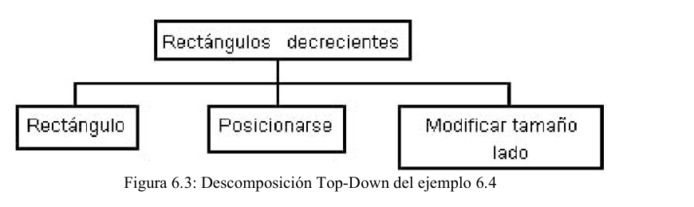
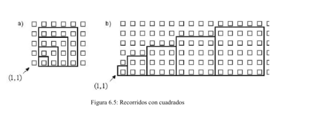
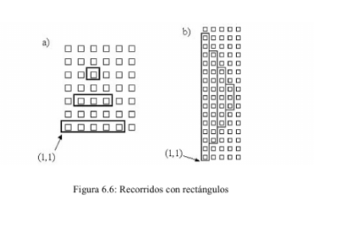
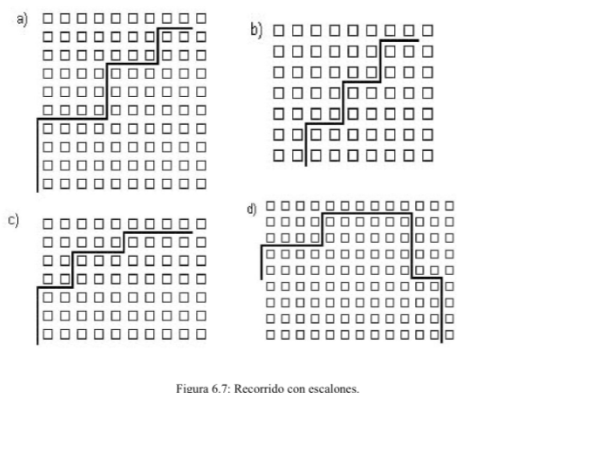

# Capítulo 6 - Parámetros de Entrada

## Objetivos

El objetivo de este capítulo es extender la sintaxis de definición de procesos a fin de permitir que se comparta información entre el módulo que llama y el módulo que es llamado.

Esto brindará la posibilidad de flexibilizar el comportamiento del proceso obteniendo, de esta forma, mejores resultados.

## Temas a tratar

- Comunicación entre módulos
- Declaración de parámetros
- Un ejemplo sencillo
- Ejemplos
- Restricción en el uso de los parámetros de entrada
- Conclusiones
- Ejercitación

## 6.1 Comunicación entre módulos

La metodología Top-Down se basa en la descomposición del problema original en partes más simples. Esto facilita su resolución dando origen a diversos módulos, cada uno de ellos con una función bien definida. Por otro lado, si es posible contar con un conjunto de subproblemas ya resueltos correctamente, estos podrán ser combinados para expresar soluciones más complejas.

Por ejemplo, podría ser útil contar con un proceso que permitiera conocer la cantidad de flores que el robot lleva en su bolsa, o tal vez podría desarrollarse un módulo que le permitiera al robot realizar un rectángulo cuyo alto y ancho se indicara durante la ejecución del programa.

Situaciones como las anteriores requieren que los procesos compartan información con el módulo que los invoca.

Los módulos desarrollados en el capítulo 5 no cuentan con esta posibilidad y su comportamiento es muy limitado ya que hacen siempre lo mismo. Por ejemplo, el proceso JuntarPapeles definido en 5.2 o el proceso Cuadrado definido en 5.6. Cada uno de estos procesos, para funcionar, sólo requieren que el robot esté posicionado en la esquina donde deben comenzar a ejecutarse. Al terminar, volverán a dejar al robot posicionado en ese mismo lugar.

Este tipo de comportamiento resulta muy acotado. Por ejemplo, ¿Qué pasaría si ahora hubiera que pedirle al proceso JuntarPapeles que retorne la cantidad de papeles que recogió? o ¿Qué pasaría si se quisiera realizar un cuadrado de lado 2 y otro de lado 5 utilizando el mismo proceso?

Cuando se quiere que el proceso interactúe con el módulo que lo llama es preciso compartir información.

La información es compartida entre módulos a través de los parámetros.

> Se puede decir entonces que, se denomina parámetro a la información que se intercambia entre módulos.

En general, existen tres tipos de parámetro que interesan considerar:

- **Parámetro de entrada:** a través de este tipo de parámetro un proceso puede recibir información del módulo que lo llama. Por ejemplo, podría modificarse el proceso Cuadrado definido en el ejemplo 5.6 para que reciba información acerca del tamaño del cuadrado a realizar. De esta forma, el mismo proceso podría ser utilizado para realizar cuadrados de diferentes tamaños.
- **Parámetro de salida:** este tipo de parámetro permite que el proceso llamado genere información y pueda enviarla al módulo que lo llamó. Note que en el caso anterior, la información era generada por el módulo que llamaba, en cambio ahora, la información la genera el módulo llamado. Por ejemplo, podría ser muy útil contar con un proceso que permita conocer la cantidad de papeles que hay en una esquina. Este proceso tendría que contar los papeles y a través de un parámetro de salida, permitir que el módulo que lo llamó pueda tener acceso a este valor.
- **Parámetro de entrada/salida:** este tipo de parámetro permite una comunicación más estrecha entre los módulos ya que la información viaja en ambos sentidos. A través de él, un dato, enviado por el módulo que llama, puede ser utilizado y modificado por el módulo llamado. Por ejemplo, el módulo JuntarPapeles podría recibir la cantidad de papeles juntados hasta el momento y actualizarla con el total de papeles de la esquina donde se encuentra parado.

En este curso vamos a trabajar con dos tipos de parámetros: los parámetros de entrada y los de entrada/salida.

## 6.2 Declaración de parámetros

La sintaxis a utilizar para definir un proceso con parámetros es la siguiente:

```
proceso nombre ( lista de parámetros )
variables
   {declare aquí las variables de este módulo}
comenzar
   {acciones a realizar dentro del módulo}
fin
```

La lista de parámetros, indicada a continuación del nombre del proceso, define cada uno de los parámetros a utilizar; es decir, la información a compartir entre el módulo llamado y el módulo que llama. Esta lista es opcional. Por ejemplo, los procesos definidos en el capítulo 5 no la utilizaban. En caso de utilizarse, la declaración de cada uno de los parámetros que la componen tiene tres partes:

1. En primer lugar debe indicarse la clase de parámetro a utilizar. Los dos tipos de parámetros que utilizaremos en la sintaxis del robot son los descritos en la sección 6.1. Se utilizará la letra E para indicar un parámetro de entrada, y las letras ES para indicar un parámetro de entrada/salida.
2. Luego de definir la clase de parámetro a utilizar debe especificarse su nombre. Este identificador será utilizado por el proceso para recibir y/o enviar información.
3. Finalmente, a continuación del nombre del parámetro y precedido por ":" debe indicarse el tipo de dato al cual pertenece el parámetro. En la sintaxis del robot, las opciones aquí son *numero* o *boolean*.

Los parámetros se separan dentro de esta lista por ";". Por ejemplo, a continuación puede verse un módulo con su lista de parámetros:

```
proceso ProcesoDePrueba(E dato:numero; ES TodoBien:boolean)
variables
 {declare aquí las variables de este módulo}
comenzar
 {acciones a realizar dentro del módulo}
fin
```

dónde *dato* es un parámetro de entrada numérico, y *TodoBien* es un parámetro de entrada/salida lógico ó booleano. Estos parámetros indicados en el encabezado del proceso son denominados parámetros formales.

> Se denominan parámetros formales a los indicados en el encabezado del proceso y se denominan parámetros actuales a los utilizados en la invocación del proceso.

Notemos la importancia de la letra que precede al nombre del parámetro. Por su intermedio puede conocerse la manera en que se compartirá la información, es decir, si es de entrada o de entrada\salida.

## 6.3 Un ejemplo sencillo

Analicemos la figura 6.1. En ella aparecen varios cuadrados de diferente tamaño. Básicamente, hay tres formas de resolver este tipo de problemas:

1. Sin utilizar modularización. Esta es la forma en que han sido resueltos los problemas en los capítulos 2 y 3. Sin embargo, hemos analizado en el capítulo 5 las ventajas de aplicar la modularización en el diseño de soluciones, por lo que resulta recomendable su utilización.
2. Utilizando procesos sin parámetros. Si se utilizara una idea similar al proceso Cuadrado definido en 5.6, debería haber tantos procesos diferentes como cuadrados de distinto tamaño de lado aparezcan en el recorrido.
3. Utilizando un único proceso cuadrado al cual pueda decírsele la longitud del lado a realizar en cada caso.

**Figura 6.1: ¿Cómo se hace para que un mismo proceso sirva para realizar todos los cuadrados?**

*(Descripción de la figura: se muestran tres recorridos del robot sobre la grilla de la ciudad, cada uno formado por cuadrados anidados/escalonados de distinto tamaño de lado, compartiendo un origen común.)*

- **a)** Recorrido formado por cuatro cuadrados escalonados, de lado 1, 2, 3 y 4 respectivamente, cada uno comenzando en la esquina donde terminó el anterior (recorrido correspondiente al Ejemplo 6.1).
- **b)** Recorrido similar al anterior pero de menor tamaño, formado por cuadrados escalonados de lados crecientes 1, 2 y 3 aproximadamente.
- **c)** Recorrido en forma de "torre" formado por cuadrados apilados de lados decrecientes, comenzando por uno grande en la base y terminando con uno pequeño en la parte superior (recorrido correspondiente al Ejemplo 6.2).

#### Ejemplo 6.1

**Ejemplo 6.1:** Programe al robot para que realice el recorrido a) de la figura 6.1.

Estos son los programas correspondientes al recorrido a) según las opciones 1 y 2 indicadas anteriormente:

**Sin Modularizar**

```
programa muchosCuadradosV1
areas
  ciudad: AreaC(1,1,100,100)
robots
  robot robot1
  comenzar
    {Cuadrado de lado 1}
    repetir 4
      mover
      derecha
    {Cuadrado de lado 2}
    repetir 4
      repetir 2
        mover
      derecha
    {Cuadrado de lado 3}
    repetir 4
      repetir 3
        mover
      derecha
    {Cuadrado de lado 4}
    repetir 4
      repetir 4
        mover
      derecha
  fin
variables
  R-info : robot1
comenzar
  AsignarArea(R-info,ciudad)
  Iniciar(R-info, 1 , 1)
fin
```

**Con varios procesos cuadrado**

```
programa muchosCuadradosV2
procesos
  proceso cuadrado1
  comenzar
    {Cuadrado de lado 1}
    repetir 4
      mover
      derecha
  fin
  proceso cuadrado2
  comenzar
    {Cuadrado de lado 2}
    repetir 4
      repetir 2
        mover
      derecha
  fin
  proceso cuadrado3
  comenzar
    {Cuadrado de lado 3}
    repetir 4
      repetir 3
        mover
      derecha
  fin
  proceso cuadrado4
  comenzar
    {Cuadrado de lado 4}
    repetir 4
      repetir 4
        mover
      derecha
  fin
areas
  ciudad: AreaC(1,1,100,100)
robots
  robot robot1
  comenzar
    cuadrado1
    cuadrado2
    cuadrado3
    cuadrado4
  fin
variables
  R-info : robot1
comenzar
  AsignarArea(R-info,ciudad)
  Iniciar(R-info, 1 , 1)
fin
```

Ambas soluciones presentan los siguientes inconvenientes:

Son difíciles de generalizar: en el programa MuchosCuadradosV1 se ha realizado todo el recorrido sin descomponer el problema. Es decir, se ha analizado e implementado cada uno de los cuadrados secuencialmente. Además podemos observar que es bastante costosa su lectura.

En el programa MuchosCuadradosV2 se han utilizado cuatro procesos (que pudieron haber sido desarrollados previamente) pero si para cada tamaño de cuadrado a realizar es necesario conocer de antemano el tamaño del cuadrado para poder escribir el proceso correspondiente. Además al aumentar la cantidad de cuadrados de diferente tamaño de lado, tendríamos que aumentar también la cantidad de procesos a escribir. No se está aprovechando la idea de que todos los cuadrados requieren del mismo recorrido, sólo sería preciso cambiar la longitud del lado. Es decir, todos se basan en repetir 4 veces: hacer el lado y girar a la derecha. Lo único que cambia entre un cuadrado y otro es la cantidad de cuadras que se deben recorrer en línea recta para hacer el lado correspondiente. En realidad, lo adecuado sería poder indicarle al proceso Cuadrado la longitud del lado que debe realizar. Para esto, el proceso cuadrado debería recibir un valor que represente la longitud del lado a través de un parámetro de entrada.

La solución toma la siguiente forma:

```
proceso cuadrado (E lado:numero)          (1)
comenzar
  repetir 4
    repetir lado                          (2)
      mover
    derecha
fin
```

En este caso, la lista de parámetros (lo que aparece entre paréntesis en la línea (1)) está formada por un único parámetro llamado *lado.* Según esta declaración, se trata de un parámetro de entrada pues su nombre se encuentra precedido por la letra E y corresponde al tipo *numero.* El identificador *lado* será utilizado por el proceso para recibir la información. Esto quiere decir que el proceso cuadrado podrá utilizar el parámetro *lado* en el cuerpo del proceso. Pero por tratarse de un parámetro de entrada, el módulo que llamó al proceso cuadrado no podrá recibir, a través de dicho parámetro, ninguna respuesta.

Cuando el proceso cuadrado sea invocado y reciba en *lado* la longitud del lado que debe realizar, este valor será utilizado por la línea (2) para efectuar el recorrido pedido.
La resolución del recorrido a) de la figura 6.1 utilizando este proceso es la siguiente:

```
programa MuchosCuadradosV3
procesos
  proceso cuadrado (E lado : numero)                {3}
  comenzar
    repetir 4
      repetir lado                                  {4}
        mover
      derecha
  fin
areas
  ciudad: AreaC(1,1,100,100)
robots
  robot robot1
  comenzar
    cuadrado(1)                                      {1}
    cuadrado(2)                                      {2}
    cuadrado(3)
    cuadrado(4)
  fin
variables
  R-info : robot1
comenzar
  AsignarArea(R-info,ciudad)
  Iniciar(R-info, 1 , 1)
fin
```

La ejecución del programa MuchosCuadradosV3 comienza por la línea (1). La primera invocación al proceso se realiza en (2). Notemos que ahora, a continuación del nombre del proceso se indica, en la invocación, el valor que recibirá el proceso cuadrado en el parámetro *lado.* Cuando el proceso cuadrado recibe el control, en la línea (3), *lado* tendrá el valor 1 y por lo tanto al ejecutarse realizará un cuadrado de lado 1. Es decir, en la línea (4) la instrucción repetir lado se reemplaza por repetir 1 ya que el parámetro lado ha tomado el valor 1.

Una vez que el proceso termina, la ejecución continúa en la línea (5) donde se vuelve a invocar al proceso cuadrado pero ahora se le pasa el valor 2 como parámetro. Esto es recibido por el proceso, en la línea (3), por lo que realizará un cuadrado de lado 2. Esto se repite dos veces mas invocando al proceso cuadrado con los valores 3 y 4 como parámetro.

En la solución anterior puede verse que:

- El código es más claro que en las dos versiones anteriores, facilitando de esta forma su lectura y comprensión. En el programa principal se nota claramente que se realizan cuatro cuadrados donde el primero tiene lado 1, el segundo lado 2, el tercero lado 3 y el cuarto lado 4.
- El proceso cuadrado, a través de su parámetro de entrada, puede ser utilizado para realizar un cuadrado de cualquier tamaño. Esto resuelve el problema de generalización presentado en *MuchosCuadradosV2*.

> ¿Explique por qué si se cambia el nombre del parámetro formal, *lado*, el llamado en el código del robot R-info no cambia?

## 6.4 Ejemplos

#### Ejemplo 6.2

**Ejemplo 6.2:** Programe al robot para que realice el recorrido c) de la figura 6.1.

Retomando el análisis realizado en el ejemplo anterior, se comenzará resolviendo este problema sin utilizar modularización. La modularización tiene que ver con el estilo de programación. Un programa que no utilice módulos tendrá algunas desventajas con respecto al que si los utiliza.

```
programa Cap6Ejemplo2TorreSinModulos
areas
  ciudad: AreaC(1,1,100,100)
robots
  robot robot1
  comenzar
    repetir 4
      repetir 5
        mover
      derecha
    Pos(2,6)
    repetir 4
      repetir 3
        mover
      derecha
    Pos(3,9)
    repetir 4
      repetir 1
        mover
      derecha
  fin
variables
  R-info : robot1
comenzar
  AsignarArea(R-info,ciudad)
  Iniciar(R-info, 1 , 1)
fin
```

Una de las principales desventajas de esta solución es la falta de claridad en el programa ya que para comprender lo que hace es necesario analizar cada una de las líneas que lo componen. Sería más fácil de comprender si se escribiera como código del cuerpo del robot R-info las siguientes instrucciones:

```
comenzar
  iniciar
  {realizar un cuadrado de lado 5}
  Pos (2,6)
  {realizar un cuadrado de lado 3}
  Pos (3,9)
  {realizar un cuadrado de lado 1}
fin
```

Si consideramos esta solución, vemos que sería conveniente utilizar el módulo cuadrado con el parámetro de entrada *lado* visto anteriormente. Por lo tanto la solución puede reescribirse como sigue:

```
programa Cap6Ejemplo2v1
procesos
  proceso cuadrado (E lado : numero)
  comenzar
    repetir 4
      repetir lado
        mover
      derecha
  fin
areas
  ciudad: AreaC(1,1,100,100)
robots
  robot robot1
  comenzar
    cuadrado(5)
    Pos(2,6)
    cuadrado(3)
    Pos(3,9)
    cuadrado(1)
  fin
variables
  R-info : robot1
comenzar
  AsignarArea(R-info,ciudad)
  Iniciar(R-info, 1 , 1)
fin
```

Como podemos observar, la primera vez que se invoca al módulo cuadrado desde el programa principal, el parámetro *lado* recibe el valor 5, luego será invocado con valor 3 y finalmente con el valor 1. A continuación se presenta otra opción de solución que muestra un programa en el cual el robot utiliza una variable llamada *long* (para representar el lado), el módulo cuadrado y el parámetro *lado:*

```
programa Cap6Ejemplo2v2
procesos
  proceso cuadrado (E lado : numero)
  comenzar
    repetir 4
      repetir lado
        mover
      derecha
  fin
areas
  ciudad: AreaC(1,1,100,100)
robots
  robot robot1
  variables
    long : numero
  comenzar
    long := 5
    cuadrado(long)                                    {1}
    Pos(2,6)
    long := long - 2
    cuadrado(long)                                    {2}
    Pos(3,9)
    long := long - 2
    cuadrado(long)                                    {3}
  fin
variables
  R-info : robot1
comenzar
  AsignarArea(R-info,ciudad)
  Iniciar(R-info, 1 , 1)
fin
```

A partir de la solución presentada se pueden analizar algunos aspectos:

- Las invocaciones (1), (2) y (3) son idénticas, sólo debemos notar que cada una envía al módulo un valor de *long* actualizado. Inicialmente le enviará el valor 5, luego el valor 3 y finalmente el valor 1, como resultado de la actualización de la variable *long*. Siguiendo este razonamiento entonces ¿podríamos utilizar una estructura repetir 3 para que la legibilidad del cuerpo del programa mejore? La respuesta es SÍ pero debemos analizar algunos aspectos adicionales para poder lograrlo. En párrafos posteriores trataremos esto.
- Existe una relación entre la esquina donde comienza el recorrido del segundo cuadrado y el tamaño del lado del primer cuadrado. Lo mismo ocurre entre el tercer cuadrado y el segundo cuadrado.

La siguiente solución contempla los aspectos analizados anteriormente:

```
programa Cap6Ejemplo2v3
procesos
  proceso cuadrado (E lado : numero)                {3}
  comenzar
    repetir 4
      repetir lado
        mover
      derecha
  fin
areas
  ciudad: AreaC(1,1,100,100)
robots
  robot robot1
  variables
    long : numero
  comenzar
    long := 5                                        {1}
    repetir 3
      cuadrado(long)                                  {2}
      Pos (PosAv + 1,PosCa + long )                    {4}
      long := long - 2                                 {5}
  fin
variables
  R-info : tipo1
comenzar
  AsignarArea(R-info,ciudad)
  Iniciar(R-info, 1 , 1)
fin
```

Sigamos la solución: en (1) se asigna el valor inicial 5 a *long* ya que el primer cuadrado de la figura es de este tamaño. Este valor es utilizado en (2) para llamar por primera vez al proceso cuadrado. El parámetro formal lado recibe en (3) el valor 5 y lo utiliza dentro del proceso para realizar el cuadrado correspondiente.

Cuando el proceso termina, retorna al robot el cual se encarga de hacer las modificaciones necesarias para realizar el próximo cuadrado, esto es: posicionar al robot (4) y decrementar la longitud del lado del cuadrado (5). En la línea (4) estamos reposicionando al robot, esto significará ubicarlo en la esquina formada por: la avenida en la que se encontraba posicionado aumentada en 1 y en la calle en la que se encontraba posicionado aumentada en el tamaño del lado del cuadrado anterior.

La próxima invocación al proceso se hará con *long* valiendo 3, de donde en (3) *lado* recibirá este valor y hará el cuadrado de lado 3.

Finalmente, esto se repite una vez más realizando el cuadrado de lado 1.

Notemos que al terminar el programa, *long* vale -1 y el robot, a diferencia de las soluciones anteriores, está posicionado en (4,10).

En consecuencia, podemos afirmar que esta última solución resuelve el problema de generalidad de las dos soluciones anteriores. Por ejemplo, si quisiéramos ahora realizar una torre de 9 cuadrados, las modificaciones resultarían mínimas. Esto se muestra en el siguiente código.

```
programa Cap6Ejemplo2v4
procesos
  proceso cuadrado (E lado : numero)                {3}
  comenzar
    repetir 4
      repetir lado
        mover
      derecha
  fin
areas
  ciudad: AreaC(1,1,100,100)
robots
  robot robot1
  variables
    long : numero
  comenzar
    long := 18
    repetir 9
      cuadrado(long)
      Pos(PosAv + 1, PosCa + long )
      long := long - 2
  fin
variables
  R-info : robot1
comenzar
  AsignarArea(R-info,ciudad)
  Iniciar(R-info, 1 , 1)
fin
```

#### Ejemplo 6.3

**Ejemplo 6.3:** Programar al robot para que realice el recorrido a) de la figura 6.1 utilizando una variable para indicar la longitud del lado de cada cuadrado.

Puede observarse que el proceso principal consiste en realizar un cuadrado, el cual va cambiando su tamaño, comenzando por un cuadrado de lado 1 hasta uno de lado 4.

El primer análisis del algoritmo es:

```
{recorrido de cuadrados con igual origen}
  {realizar los cuatro cuadrados, donde para cada uno es necesario ...}
    {hacer un cuadrado del lado correspondiente}
    {incrementar el lado del cuadrado}
```

El cuadrado, como puede observarse, debe ir modificando su tamaño. Por lo tanto, es necesario definir un atributo que represente esta condición. Se utilizará para ello la variable *largo.* Poniendo en marcha puede escribirse el siguiente programa ede la siguiente manera:

```
programa Cap6Ejemplo3
procesos
  proceso cuadrado (E lado : numero)
  comenzar
    {el lado tiene tantas cuadras como indica largo}
    repetir 4
      repetir lado
        mover
      derecha
  fin
areas
  ciudad: AreaC(1,1,100,100)
robots
  robot robot1
  variables
    largo : numero
  comenzar
    {valor inicial, el primero cuadrado es de uno}
    largo := 1
    repetir 4
      cuadrado(largo)
      {se incrementa el valor que indica el largo del lado}
      largo := largo + 1
  fin
variables
  R-info : robot1
comenzar
  AsignarArea(R-info,ciudad)
  Iniciar(R-info, 1 , 1)
fin
```

A continuación se describe la ejecución del algoritmo. La segunda instrucción asigna el valor 1 a la variable *largo,* el cual se corresponde con el tamaño del lado del primer cuadrado. Cuando se llama al proceso cuadrado, se le manda al mismo la información correspondiente a la medida del lado. En esta primera invocación se le pasa el valor 1. Notemos que en el encabezado del proceso se encuentra definido un dato, *lado,* el cual se corresponde con la variable *largo* utilizada en la invocación; pero que, como se observa, se lo llama con nombre diferente. El valor de la variable *largo* se copia en el dato *lado.* A partir de este momento, *lado* puede ser utilizado en el proceso cuadrado con el valor que recibió. Observemos también que cuando se indica que el valor de *largo* se copia en *lado* es equivalente a asignar a *lado* el valor de *largo*.

El proceso realiza un cuadrado de lado 1. Cuando el mismo finaliza, la instrucción siguiente a cuadrado consiste en aumentar en uno el valor de la variable *largo,* teniendo ahora el valor 2. Esto se repite tres veces más, completando el recorrido.

#### Ejemplo 6.4

**Ejemplo 6.4:** Se desea programar al robot para que realice el recorrido de la figura 6.2

**Figura 6.2: Torre de Rectángulos**

*(Descripción de la figura: se muestra una torre formada por rectángulos apilados. El primero, el de más abajo, tiene 19 cuadras de base por 5 de alto, y el último, el de más arriba, tiene 3 de base por 1 de alto, de forma que cada rectángulo difiere con su superior en 4 cuadras de base y 1 cuadra en su altura.)*

Puede verse que la figura presenta diferentes rectángulos. El primero (el de más abajo) de 19 cuadras de base por 5 de alto, y el último (el de más arriba) de 3 por 1, o sea que cada rectángulo difiere con su superior en 4 cuadras de base y 1 cuadra en su altura.

El diseño Top-Down correspondiente al problema se muestra en la figura 6.3. El esquema del algoritmo quedará como:

**Figura 6.3: Descomposición Top-Down del ejemplo 6.4**



```
{ torre de rectángulos }
  { realizar los cinco  rectángulos, como sigue ... }
    { hacer un rectángulo }
    { posicionarse para el siguiente }
    { modificar las dimensiones }
```

El rectángulo, a diferencia del cuadrado del ejemplo anterior, necesita dos elementos para indicar su tamaño. Por lo tanto, es necesario definir dos variables que representen esta condición. Para ello se utilizarán las variables *ancho* y *alto*.

Detallando lo anterior, la implementación de esta solución es:

```
programa Cap6Ejemplo4
procesos
  proceso Rectangulo (E base : numero; E altura : numero)
  comenzar
    repetir 2
      repetir altura
        mover
      derecha
      repetir base
        mover
      derecha
  fin
areas
  ciudad: AreaC(1,1,100,100)
robots
  robot robot1
  variables
    ancho, alto : numero
  comenzar
    ancho := 19                                       {1}
    alto := 5                                          {2}
    repetir 5
      Rectangulo(ancho,alto)                            {3}
      Pos(PosAv + 2, PosCa + alto)                       {4}
      ancho := ancho - 4                                 {5}
      alto := alto - 1                                   {6}
  fin
variables
  R-info : robot1
comenzar
  AsignarArea(R-info,ciudad)
  Iniciar(R-info, 1 , 1)
fin
```

A continuación se describe la ejecución del algoritmo. En (1) y (2) se define el tamaño del primer rectángulo (el de más abajo). Cuando se llama al proceso Rectangulo, se le manda al mismo información correspondiente a la medida de sus lados. En esta primera invocación se le pasan los valores 19 y 5 respectivamente.

El proceso realiza un rectángulo de 19 por 5. Cuando finaliza, se devuelve el control al robot en la línea siguiente a (3) donde se posiciona al robot para realizar el siguiente rectángulo (4). Luego en (5) y (6) se modifican adecuadamente los valores que definen *alto y ancho* del próximo rectángulo.

En el problema planteado se observa que es necesario que el módulo reciba información. En este caso, el proceso Rectangulo recibe dos parámetros de entrada, *base y altura,* que son enviados por el robot a través de las variables *ancho* y *alto,* respectivamente.

#### Ejemplo 6.5

**Ejemplo 6.5:** Supongamos que se dispone del siguiente proceso:

```
proceso escalon(E entral : numero, E entra2 : numero)
```

donde *entra1* corresponde a la altura y *entra2* corresponde al ancho de un escalón. Utilice el proceso anterior para resolver el recorrido de la figura 6.4.

**Figura 6.4: Recorrido en escalones**

*(Descripción de la figura: se muestran cuatro filas de escalones sobre la grilla de la ciudad; el recorrido dibujado sube en forma de escalera desde la fila inferior izquierda hacia la derecha, en tres escalones de altura y ancho crecientes.)*

A continuación se presentan dos alternativas para resolver este problema:

**Cap6Ejemplo5V1**

```
programa Cap6Ejemplo5V1
procesos
  proceso escalon (E entral:numero;
                    E entra2:numero)
  comenzar
    repetir entra1
      mover
      derecha
      repetir entra2
        mover
      repetir 3
        derecha
  fin
areas
  ciudad: AreaC(1,1,100,100)
robots
  robot robot1
  comenzar
    escalon(1,2)
    escalon(1,3)
    escalon(1,4)
  fin
variables
  R-info : robot1
comenzar
  AsignarArea(R-info,ciudad)
  Iniciar(R-info, 1 , 1)
fin
```

**Cap6Ejemplo5V2**

```
programa Cap6Ejemplo5V2
procesos
  proceso escalon(E entral1:numero;
                   E entra2:numero)
  comenzar
    repetir entra1
      mover
      derecha
      repetir entra2
        mover
      repetir 3
        derecha
  fin
areas
  ciudad: AreaC(1,1,100,100)
robots
  robot robot1
  variables
    long : numero
  comenzar
    long := 2
    repetir 3
      escalon (1,long)
      long:= long + 1
  fin
variables
  R-info : robot1
comenzar
  AsignarArea(R-info,ciudad)
  Iniciar (R-info,1,1)
fin
```

Compare las soluciones anteriores e indique:

> ¿Ambas soluciones realizan el mismo recorrido?
>
> ¿Cuál de las dos soluciones elegiría si debe continuar el recorrido en forma de escalera hasta completar 20 escalones donde cada escalón tiene una cuadra más de ancho que el anterior?

El ejemplo anterior pretende mostrar que para utilizar un proceso sólo es necesario conocer qué hace y no cómo lo hace. Además, toda la información necesaria para interactuar con el módulo se encuentra resumida en su primera línea, ya que allí aparece, no sólo el nombre del proceso sino además su lista de parámetros.
A continuación se indican dos posibles implementaciones del proceso escalón:

**Implementación 1**

```
proceso escalon (E entra1:numero;
                  E entra2:numero)
comenzar
  repetir entra1
    mover
    derecha
  repetir entra2
    mover
    izquierda
fin
```

**Implementación 2**

```
proceso escalon(E entra1:numero;
                 E entra2: numero)
comenzar
  Pos(PosAv+entra2,PosCa+Entra1)
  izquierda
  repetir entra2
    mover
    izquierda
  repetir entra1
    mover
  Pos(PosAv+entra2,PosCa+Entra1)
  repetir 2
    derecha
fin
```

> ¿Es posible implementar el proceso escalón de manera que el primer parámetro represente la altura y el segundo el ancho? Notemos que podemos elegir cualquier nombre para los parámetros formales (no importa si no se llaman *entra1* y *entra2*).

## 6.5 Restricción en el uso de los parámetros de entrada

En los ejemplos anteriores se han desarrollado procesos con parámetros de entrada y en todos los casos, la información recibida de esta forma ha sido utilizada como "de lectura". En otras palabras, en ninguno de los ejemplos se ha asignado un valor sobre un parámetro de entrada.

Esta restricción es tanto conceptual como sintáctica. Desde el punto de vista conceptual, no tiene sentido modificar el valor de un parámetro de entrada ya que es información recibida desde el módulo que realizó la invocación, el cual no espera recibir ninguna respuesta a cambio. Desde el punto de vista sintáctico, no es posible asignar dentro del proceso un valor al parámetro de entrada.

A continuación se ejemplificará esta restricción:

#### Ejemplo 6.6

**Ejemplo 6.6:** Escriba un proceso que le permita al robot recorrer la avenida donde se encuentra parado, desde la calle 1 hasta la calle 10 dejando en cada esquina una flor menos que en la esquina anterior. La cantidad de flores de la primera esquina se recibe como parámetro y se garantiza que este valor es mayor que 10 (seguro tengo algo que depositar en cada una de las 10 esquinas). El proceso termina cuando el robot haya recorrido las 10 esquinas. El proceso será invocado con el robot ubicado al comienzo de la avenida con dirección norte. Por simplicidad considere que lleva en su bolsa la cantidad de flores necesarias.

Por ejemplo, si el robot debe dejar en la primera esquina 12 flores, el recorrido consistirá en depositar: 12 flores en la primera, 11en la 2da, 10 en la 3ra.y 9 en la 4ta. Para esto es necesario que el proceso reciba como parámetro la cantidad de la primera esquina

A continuación se detalla una implementación que presenta un error referido a la restricción del parámetro de entrada:

```
proceso UnaMenosV1 ( E FloresIniciales : numero )
comenzar
{Cada esquina tendrá una flor menos que la anterior}
  mientras (PosCa<11)
  {Depositar las flores indicadas (seguro puede hacerlo)}
    repetir FloresIniciales
      depositarFlor
    mover
    FloresIniciales := FloresIniciales - 1              (1)
Fin
```

El proceso anterior utiliza una iteración para controlar que el robot no intente depositar en la calle 11.

Por otro lado, la repetición deposita las flores sin preguntar si hay en la bolsa porque es una precondición de este ejemplo que el robot lleva la cantidad de flores necesarias.

El problema de esta implementación se encuentra en la línea (1) donde se asigna un valor en el parámetro de entrada. Esto NO es válido en la sintaxis del ambiente de programación del robot. Para poder hacerlo, será necesario recurrir a una variable auxiliar, que sólo será conocida dentro del proceso.

La implementación correcta es la siguiente:

```
proceso UnaMenosV2 ( E FloresIniciales : numero)
variables
  cuantas : numero
comenzar
  cuantas := FloresIniciales                            (1)
  {Cada esquina tendrá una flor menos que la anterior}
  mientras (PosCa<11)
    repetir cuantas
      depositarFlor
    mover
    cuantas := cuantas - 1
fin
```

De esta forma, el parámetro de entrada sólo es leído al inicio del proceso, en la línea (1) y a partir de allí se utiliza la variable local.

Si bien esta forma de utilizar los parámetros de entrada puede resultar restrictiva, es importante recordar que durante todos los ejemplos anteriores no fue preciso modificar el valor del parámetro. Esto no es casual, sino que se encuentra asociado a la función que cumple la información recibida por el proceso. Si se trata de información de entrada, es de esperar que su valor permanezca SIN modificación alguna dentro del módulo llamado.

El hecho de tener que conocer para cada esquina la cantidad de flores a depositar es independiente de la información recibida inicialmente referida a la cantidad de flores de la primera esquina. Si el proceso necesita manejar este dato, deberá utilizar sus propias variables para hacerlo.

- Se propone rehacer el ejemplo 6.6 para que el robot pueda aplicar esta distribución de flores a toda la avenida. Además se desconoce si inicialmente posee la cantidad de flores necesarias para hacerlo.

## 6.6 Conclusiones

En este capítulo se han presentado los parámetros de entrada como medio de comunicación entre módulos.

Este tipo de parámetros permite que el proceso llamado reciba información de quien lo llama. Dicha información podrá ser utilizada internamente por el proceso para adaptar su comportamiento.

Utilizando parámetros de entrada, la información viaja en un único sentido, desde el módulo que llama hacia el módulo llamado.

## Ejercitación

1. Escriba un proceso que le permita al robot realizar un cuadrado a partir de la esquina donde está parado, girando en la dirección de las agujas del reloj y recibiendo como dato la longitud del lado.

2. Utilice el proceso de 1. para realizar los recorridos de la figura 6.5 a partir de (1,1).

   **Figura 6.5: Recorridos con cuadrados**

   

   *(Descripción: dos recorridos con cuadrados anidados/escalonados a partir de la esquina (1,1). a) muestra varios cuadrados de tamaño creciente compartiendo origen en (1,1). b) muestra una hilera de cuadrados escalonados de tamaño creciente, comenzando en (1,1).)*

3. Escriba un proceso que le permita al Robot realizar un rectángulo a partir de la esquina donde está parado cuyas dimensiones, alto y ancho, se reciben.

4. Utilice el proceso realizado en 3. para que el Robot efectúe los recorridos de la figura 6.6 a partir de (1,1).

   **Figura 6.6: Recorridos con rectángulos**

   

   *(Descripción: a) una serie de rectángulos escalonados de tamaño creciente hacia abajo, comenzando en (1,1). b) una columna angosta compuesta por rectángulos apilados, comenzando en (1,1).)*

5. Programe al robot para que realice cada uno de los cuatro recorridos de la figura 6.7.

6. a) Escriba un proceso que le permita al robot recorrer una avenida cuyo número se ingresa como parámetro de entrada.

   b) Utilice el proceso de 6.a) para recorrer todas las avenidas de la ciudad.

   c) Utilice el proceso de 6.a) para recorrer las avenidas 5, 6, 7 … 15.

   d) Utilice el proceso de 6.a) para recorrer las avenidas pares de la ciudad.

   **Figura 6.7: Recorrido con escalones.**

   

   *(Descripción: cuatro variantes (a, b, c, d) de recorridos en forma de escalera sobre la grilla de la ciudad, cada una con distinta cantidad y disposición de escalones y calles recorridas.)*

7. Programe al robot para que realice un módulo CalleFlor que recorra una calle cuyo número se ingresa como parámetro, hasta juntar tantas flores como lo indica otro parámetro de entrada que este módulo recibe. La cantidad de flores seguro existe.

8. Programe al robot para que realice un módulo Avenida que recorra una avenida, cuyo número se ingresa como parámetro, hasta dar tantos pasos como los indicados por otro parámetro de entrada que este módulo recibe. Es decir, si recibe los valores 3 y 1, debe dar 1 paso en la avenida 3; si recibe 12 y 5 debe dar 5 pasos en la avenida 12; y así sucesivamente. En cambio, si recibe algún valor negativo no debe dar pasos. Considere que la cantidad máxima de pasos que podrá dar es 99, cualquier valor que reciba mayor que 99, implicará realizar sólo hasta 99 pasos. Los números de avenida seguro son entre 1 y 100.

### Código relacionado con la ejercitación

| Ejercicio | Implementaciones disponibles |
|---|---|
| 1 | [Cap6_Preg_1](../../soluciones/por-capitulo/capitulo-06/Cap6_Preg_1) |
| 2 | [variante B](../../soluciones/por-capitulo/capitulo-06/Cap6_Preg_2B), [variante C](../../soluciones/por-capitulo/capitulo-06/Cap6_Preg_2C) |
| 3 | [Cap6_Preg_3](../../soluciones/por-capitulo/capitulo-06/Cap6_Preg_3) |
| 4 | [variante A](../../soluciones/por-capitulo/capitulo-06/Cap6_Preg_4A), [variante B](../../soluciones/por-capitulo/capitulo-06/Cap6_Preg_4B) |
| 5 | [A](../../soluciones/por-capitulo/capitulo-06/Cap6_Preg_5A), [B](../../soluciones/por-capitulo/capitulo-06/Cap6_Preg_5B), [C](../../soluciones/por-capitulo/capitulo-06/Cap6_Preg_5C), [D](../../soluciones/por-capitulo/capitulo-06/Cap6_Preg_5D) |
| 6 | [A](../../soluciones/por-capitulo/capitulo-06/Cap6_Preg_6A), [B](../../soluciones/por-capitulo/capitulo-06/Cap6_Preg_6B), [C](../../soluciones/por-capitulo/capitulo-06/Cap6_Preg_6C), [D](../../soluciones/por-capitulo/capitulo-06/Cap6_Preg_6D) |
| 7 | [Cap6_Preg_7](../../soluciones/por-capitulo/capitulo-06/Cap6_Preg_7) |
| 8 | [Cap6_Preg_8](../../soluciones/por-capitulo/capitulo-06/Cap6_Preg_8) |

Ejemplos complementarios: [cuadrados sin parámetros](../../ejemplos/parametros-entrada/cuadrados_sin.ri), [cuadrados con parámetros](../../ejemplos/parametros-entrada/cuadrados_con.ri), [ejemplo 1](../../ejemplos/parametros-entrada/ejemplo_1.ri) y [ejemplo 2](../../ejemplos/parametros-entrada/ejemplo2.ri).
